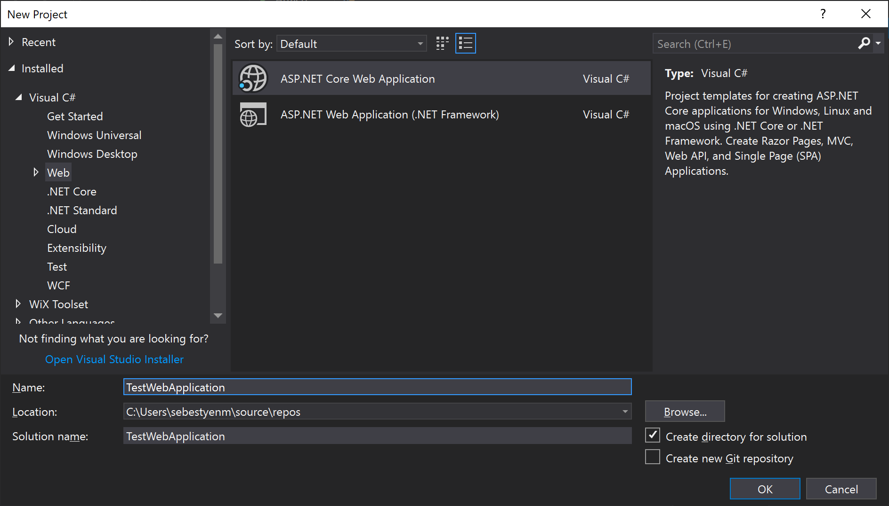
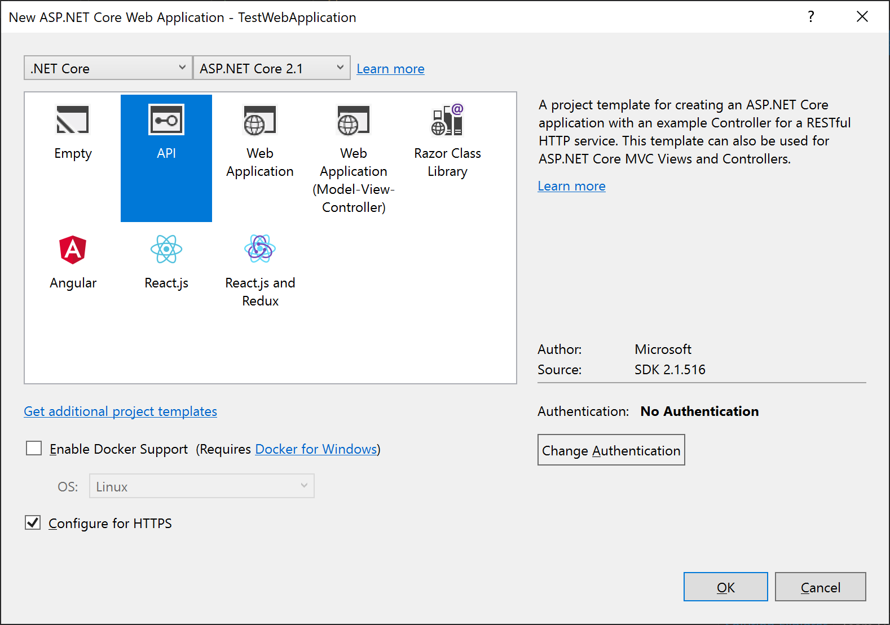
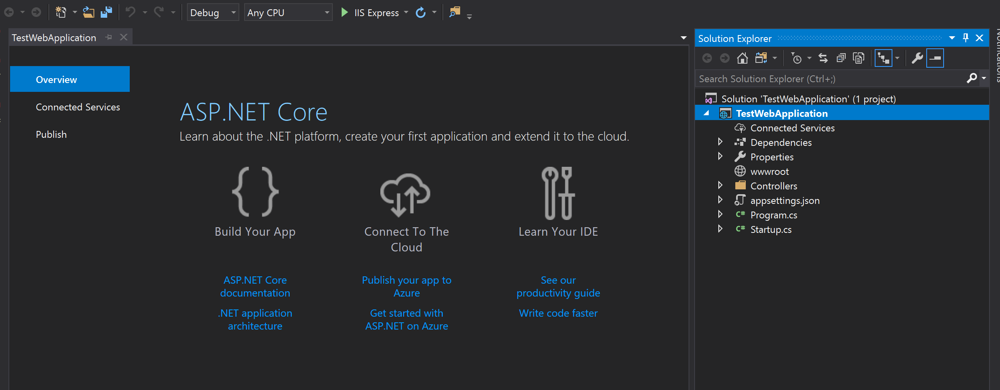
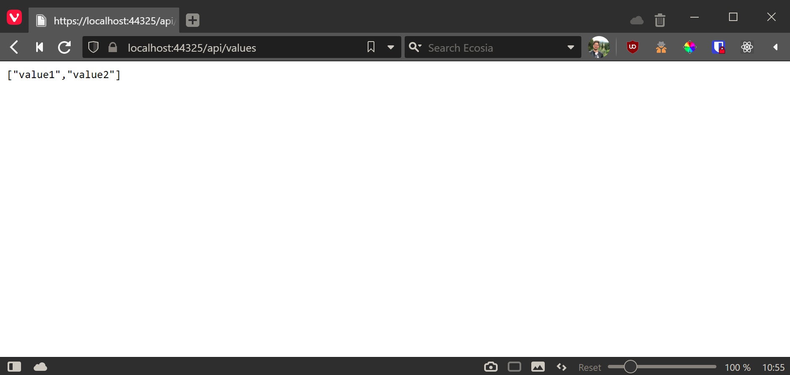
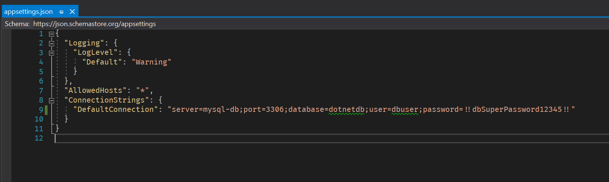

### Objective
 
In this article, we are going to understand how to connect .NET Core Application with MySQL/MariaDB and read data from MySQL (placed in Docker container), using .NET Core MySQL connector.

===

### Prerequistiques
* Configured Docker (Download [here: https://www.docker.com/products/docker-desktop](https://www.docker.com/products/docker-desktop))
* .NET Core Environment Setup. (you can get it [here: https://www.microsoft.com/net/download/core](https://www.microsoft.com/net/download/core)).
* Visual Studio 2015 or newer
* MySQL database

### Steps to create a .NET Core Web app

Go to `File` -> `New Project` -> Select `Web` from templates -> choose `ASP.NET Core Web Application`.
 
Provide the name for the Web application and click OK.

For creating Web API, choose "API". If you are building an ASP.NET web application, chooe "Web Application". Else choose the architecture you want to use.

Build the application to check whether it's working well.

If "API" type is chosen, an exemplary array result should be seen.

### Configure MySQL/MariaDB Database

Use this docker compose file for configuring a basic MySQL/MariaDB:

>     mysql-db:
>       image: mariadb
>       container_name: mysql-db
>       restart: always
>       environment:
>         MYSQL_DATABASE: 'dotnetdb'
>         MYSQL_USER: 'dbuser'
>         MYSQL_PASSWORD: '!!dbSuperPassword12345!!'
>         MYSQL_ROOT_PASSWORD: '##Unbelievably-long-password-for-mysql88'
>       ports:
>         - '3306:3306'
>       expose:
>         - '3306'
>     
>     mysql-adminer:
>       image: adminer
>       container_name: mysql-adminer
>       restart: always
>       ports:
>         - 3307:8080
         
For browsing `host:3307`, we should be able to log in to the database through adminer:

In Adminer, I created an example table "PieSettings" with two columns:

### Connect with MySQL
 
To connect with the MySQL database, we must have some NuGet installed in our Application.
Go to Application -> right click on project name -> select `Manage Nuget Packages` -> type `MySql.Data`

Go to Project root -> `appsettings.json` -> enter the connection string, as shown below.
 
>     "ConnectionStrings": {
>         "DefaultConnection": "server=mysql-db;port=3306;database=dotnetdb;user=dbuser;password=!!dbSuperPassword12345!!"
>      }
 
 
 
Create new folder Models and add Class `PieContext` & `PieSettings` in it.
 
Add `PieSettings` properties in a `PieSettings` class.

>     namespace Dotnetapp.Models
>     {
>         public class PieSettings
>         {
>             public string SettingCode { get; set; }
>     
>             public string SettingValue { get; set; }
>         }
>     }

Create a new `PieboyContext` class, which will contain the connections and settings data entities, as shown below.

>     using System.Collections.Generic;
>     using MySql.Data.MySqlClient;
>     
>     namespace Dotnetapp.Models
>     {
>         public class PieboyContext    
>         {    
>             public string ConnectionString { get; set; }    
>         
>             public PieboyContext(string connectionString)    
>             {    
>                 this.ConnectionString = connectionString;    
>             }    
>         
>             private MySqlConnection GetConnection()    
>             {    
>                 return new MySqlConnection(ConnectionString);    
>             }  
>     
>             
>             public List<PieSettings> GetAllSettings()  
>             {  
>                 List<PieSettings> list = new List<PieSettings>();  
>       
>                 using (MySqlConnection conn = GetConnection())  
>                 {  
>                     conn.Open();  
>                     MySqlCommand cmd = new MySqlCommand("select * from PieSettings", conn);  
>       
>                     using (var reader = cmd.ExecuteReader())
>                     {  
>                         while (reader.Read())  
>                         {  
>                             list.Add(new PieSettings()  
>                             {  
>                                 SettingCode = reader["SettingCode"].ToString(),
>                                 SettingValue = reader["SettingValue"].ToString()
>                             });  
>                         }  
>                     }  
>                 }  
>                 return list;  
>             }
>     
>             public void SetSetting(PieSettings setting)
>             {
>                 using (MySqlConnection conn = GetConnection())  
>                 {  
>                     conn.Open();  
>                     MySqlCommand cmd = new MySqlCommand("select * from PieSettings where settingCode = '" + setting.SettingCode + "'", conn);  
>       
>                     using (var reader = cmd.ExecuteReader())
>                     {
>                         MySqlCommand c;
>                         if (reader.HasRows)
>                         {
>                             c = new MySqlCommand(
>                                 "update PieSettings set settingValue = '" + setting.SettingValue +
>                                 "' where settingCode = '" + setting.SettingCode + "'", conn);
>     
>                         }
>                         else
>                         {
>                             c = new MySqlCommand(
>                                 "insert into PieSettings values('" + setting.SettingCode +
>                                 "', '" + setting.SettingValue + "';", conn);
>                         }
>     
>                         conn.Close();
>                         conn.Open();
>                         c.ExecuteNonQuery();
>                     }  
>                 }  
>             }
>         }    
>     }
>     

To use context in our Application, we need to register instance as a Service in our Application. To register context, we need to add on line of code in ‘startup.cs’ file under ‘ConfigureServices’ method.

>     public void ConfigureServices(IServiceCollection services)
>     {
>          services.AddMvc().SetCompatibilityVersion(CompatibilityVersion.Version_2_1);
>          services.Add(new ServiceDescriptor(typeof(PieboyContext), new PieboyContext(Configuration.GetConnectionString("DefaultConnection")))); 
>      }
    
### Fetch data from My SQL database

To get the data from the database, we need to call `GetAllSettings()` method on our DB context.

>     public ActionResult<string> GetSettingValue(string settingKey)
>        {
>            PieboyContext context = HttpContext.RequestServices.GetService(typeof(PieboyContext)) as PieboyContext;
>            PieSettings s = context.GetAllSettings().FirstOrDefault(q => q.SettingCode == settingKey);
>                 
>            return Ok("{\"value\": \"" + s.SettingValue +"\"}");
>        }
    
