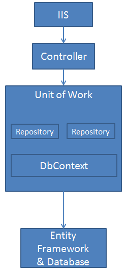

In this article we will discuss several topics that will allow you to have a ready solution to manage our data with Entity Framework.

First, we will recall the principles of the Entity Framework, the Repository pattern and discuss that of the Unit Of Work.

The next part will be dedicated to its implementation.

===

### Requirements

* Knowledge of the ORM Entity Framework

* Knowledge of the Repository pattern

* Knowledge of object modeling

* Installing the `Microsoft.EntityFrameworkCore` and `Microsoft.EntityFrameworkCore.Relational` Nuget packages

### Conceptual approach

#### Entity Framework conceptional reminder

Entity Framework is an ORM (Object Relationnal Mapping). It is a tool for creating a Data Access Layer (DAL) linked to a relational database. It offers the creation of a conceptual schema composed of entities that allow the manipulation of a data source, without writing a single line of SQL, thanks to LINQ To Entities. Compared to other object-relational mapping (ORM) solutions, Entity Framework ensures the independence of the conceptual schema (entities or objects) from the logical schema of the database, i.e. tables. Thus, the product code and the conceptual model are not linked to a specific database.

### Repository Pattern conceptional reminder

This design pattern meets a need for access to the data stored in the database. Its main purpose is to isolate the data access layer from the business layer.
It exposes various methods based on the `CRUD` model (Create, Read, Update, Delete). In the context of an Entity Framework project, a Repository (or repository) is often confined to the manipulation of a specific entity. There is therefore one Repository per managed entity.

### What is the Unit of Work pattern?

Unit Of Work is a design pattern that addresses many development issues and provides the following benefits:

* It allows logical database modifications to be kept in memory in a coherent whole.

* It allows basic operations to be orchestrated in the form of transactions so that changes can be rolled back in the event of problems.

* It allows you to isolate your application from changes in the data layer and thus facilitate testing and sharing of developments.

* It coordinates the work of the different Repositories by creating a single shared context.

For the sake of performance, consistency, maintainability and speed of development, the developer, lazy as usual, tends to orient themselves as much as possible, towards factorization and the re-usability of the code.

In the following implementation, this will be discussed. We are going to create Repositories implementing a generic Repository model.

The object model is not the easiest to understand. It is easier to reason in a linear and concrete way, than in an abstract way and with notions of inheritance or polymorphism. This requires a certain distance and a capacity for abstraction which is not necessarily intuitive and more difficult to implement.

In the implementation that follows, we will use the principles of inheritance, abstraction, polymorphism and generic types.

We will also respect the SOLID principle.

### Solution

#### Context presentation

In this article we will deal with series, seasons and episodes. A series contains a list of seasons, each of which contains episodes.

Consider the following Entity Framework entity model: each netity that we want to manage will inherit from an abstract parent class named `EntityBase`. (In github example, I used Microsoft's Adventure Works db.)

>     /// 

>     /// Base class for each entities for the data source.
>     /// 

>     public abstract class EntityBase
>     {
>         
>     }
>     public partial class Customer
>     {
>          public string Title { get; set; }
>          public string FirstName { get; set; }
>          public string LastName { get; set; }
>     }

### The repository layer
#### The GenericRepository
Here, we are going to get down to creating a generic Repository model that can be implemented by all of our Entity Repositories.

The goal is to create a simple and viable Repository model implementing the basic functions of the CRUD (Create, Read, Update, Delete) and which can be suitable for all types of entities managed by the Entity Framework.

To begin with, we will create the Interface of this Generic Repository accepting any type of entity inheriting from the abstract Entity class in order to be able to implement it later.

>     /// 

>     /// Base repository interface for each repository implementation.
>     /// 

>     /// <typeparam name="TEntity"></typeparam>
>     // Source: https://blog.dcube.fr/index.php/2019/09/05/generic-repository-unit-of-work-et-entity-framework/
>     public interface IRepository<TEntity> where TEntity : EntityBase
>     {
>         DbContext DbContext { get; }
>     
>         #region CREATE
>     
>         /// 

>         /// Inserts a new entity.
>         /// 

>         /// <param name="entity">The entity to insert.</param>
>         void Add(TEntity entity);
>     
>         /// 

>         /// Inserts a range of entities.
>         /// 

>         /// <param name="entities">The entities to insert.</param>
>         void Add(IEnumerable<TEntity> entities);
>     
>         #endregion
>     
>         #region READ
>     
>         /// 

>         /// Finds an entity with the given primary key values.
>         /// 

>         /// <param name="keyValues">The values of the primary key.</param>
>         /// <returns>The found entity or null.</returns>
>         TEntity GetById(params object[] keyValues);
>     
>         /// 

>         /// Gets the first or default entity based on a predicate, orderby and children inclusions.
>         /// 

>         /// <param name="predicate">A function to test each element for a condition.</param>
>         /// <param name="orderBy">A function to order elements.</param>
>         /// <param name="include">Navigation properties separated by a comma. Find usage: https://stackoverflow.com/a/47039696/1694775 </param>
>         /// <param name="disableTracking">A boolean to disable entities changing tracking.</param>
>         /// <returns>The first element satisfying the condition.</returns>
>         /// <remarks>This method default no-tracking query.</remarks>
>         TEntity GetFirstOrDefault(
>             Expression<Func<TEntity, bool>> predicate = null,
>             Func<IQueryable<TEntity>, IOrderedQueryable<TEntity>> orderBy = null,
>             Func<IQueryable<TEntity>, IIncludableQueryable<TEntity, object>> include = null,
>             bool disableTracking = true
>         );
>     
>         /// 

>         /// Gets the single or default entity based on a predicate, orderby and children inclusions.
>         /// 

>         /// <param name="predicate">A function to test each element for a condition.</param>
>         /// <param name="orderBy">A function to order elements.</param>
>         /// <param name="include">Navigation properties separated by a comma. Find usage: https://stackoverflow.com/a/47039696/1694775 </param>
>         /// <param name="disableTracking">A boolean to disable entities changing tracking.</param>
>         /// <returns>The first element satisfying the condition.</returns>
>         /// <remarks>This method default no-tracking query.</remarks>
>         TEntity GetSingleOrDefault(
>             Expression<Func<TEntity, bool>> predicate = null,
>             Func<IQueryable<TEntity>, IOrderedQueryable<TEntity>> orderBy = null,
>             Func<IQueryable<TEntity>, IIncludableQueryable<TEntity, object>> include = null,
>             bool disableTracking = true
>         );
>     
>         /// 

>         /// Gets all entities.
>         /// 

>         /// <returns>The all dataset.</returns>
>         IQueryable<TEntity> GetAll();
>     
>         /// 

>         /// Gets the entities based on a predicate, orderby and children inclusions.
>         /// 

>         /// <param name="predicate">A function to test each element for a condition.</param>
>         /// <param name="orderBy">A function to order elements.</param>
>         /// <param name="include">A function to include navigation properties. Find usage: https://stackoverflow.com/a/47039696/1694775 </param>
>         /// <param name="disableTracking">A boolean to disable entities changing tracking.</param>
>         /// <returns>A list of elements satisfying the condition.</returns>
>         /// <remarks>This method default no-tracking query.</remarks>
>         IEnumerable<TEntity> GetMultiple(
>             Expression<Func<TEntity, bool>> predicate = null,
>             Func<IQueryable<TEntity>, IOrderedQueryable<TEntity>> orderBy = null,
>             Func<IQueryable<TEntity>, IIncludableQueryable<TEntity, object>> include = null,
>             bool disableTracking = true
>         );
>     
>         /// 

>         /// Uses raw SQL queries to fetch the specified entity data.
>         /// 

>         /// <param name="sql">The raw SQL.</param>
>         /// <param name="parameters">The parameters.</param>
>         /// <returns>A list of elements satisfying the condition specified by raw SQL.</returns>
>         IQueryable<TEntity> FromSql(string sql, params object[] parameters);
>     
>         #endregion
>     
>         #region UPDATE
>     
>         /// 

>         /// Updates the specified entity.
>         /// 

>         /// <param name="entity">The entity.</param>
>         void Update(TEntity entity);
>     
>         /// 

>         /// Updates the specified entities.
>         /// 

>         /// <param name="entities">The entities.</param>
>         void Update(IEnumerable<TEntity> entities);
>     
>         #endregion
>     
>         #region DELETE
>     
>         /// 

>         /// Deletes the entity by the specified primary key.
>         /// 

>         /// <param name="id">The primary key value.</param>
>         void Delete(object id);
>     
>         /// 

>         /// Deletes the specified entity.
>         /// 

>         /// <param name="entity">The entity to delete.</param>
>         void Delete(TEntity entityToDelete);
>     
>         /// 

>         /// Deletes the specified entities.
>         /// 

>         /// <param name="entities">The entities to delete.</param>
>         void Delete(IEnumerable<TEntity> entities);
>     
>         #endregion
>     
>         #region OTHER
>     
>         /// 

>         /// Gets the count based on a predicate.
>         /// 

>         /// <param name="predicate">A function to test each element for a condition.</param>
>         /// <returns>The number of rows.</returns>
>         int Count(Expression<Func<TEntity, bool>> predicate = null);
>     
>         /// 

>         /// Check if an element exists for a condition.
>         /// 

>         /// <param name="predicate">A function to test each element for a condition.</param>
>         /// <returns>A boolean</returns>
>         bool Exists(Expression<Func<TEntity, bool>> predicate);
>     
>         #endregion

So here we are with a `Repository` contract. However, it is not functional as it is, we must implement it in a mother class that can be used as such for simple needs, but that the child Repositories can extend. Let's implement the CRUD methods and the database context.

>     // Source: https://blog.dcube.fr/index.php/2019/09/05/generic-repository-unit-of-work-et-entity-framework/
>     public class RepositoryBase<TEntity> : IRepository<TEntity> where TEntity : EntityBase
>     {
>         public DbContext DbContext { get; }
>         protected readonly DbSet<TEntity> _dbSet;
>     
>         /// 

>         /// Initializes a new instance of the RepositoryBase<TEntity>.
>         /// 

>         /// <param name="dbContext">The database context.</param>
>         public RepositoryBase(DbContext dbContext)
>         {
>             DbContext = dbContext ?? throw new ArgumentNullException(nameof(dbContext));
>             _dbSet = DbContext.Set<TEntity>();
>         }
>     
>         #region CREATE
>     
>         public virtual void Add(TEntity entity)
>         {
>             _dbSet.Add(entity);
>         }
>     
>         public virtual void Add(IEnumerable<TEntity> entities) => _dbSet.AddRange(entities);
>     
>         #endregion
>     
>         #region READ
>     
>         public virtual TEntity GetById(params object[] keyValues) => _dbSet.Find(keyValues);
>     
>         public virtual TEntity GetFirstOrDefault(
>             Expression<Func<TEntity, bool>> predicate = null,
>             Func<IQueryable<TEntity>, IOrderedQueryable<TEntity>> orderBy = null,
>             Func<IQueryable<TEntity>, IIncludableQueryable<TEntity, object>> include = null,
>             bool disableTracking = true
>         )
>         {
>             IQueryable<TEntity> query = ParameterUpQuery(_dbSet, predicate, include, disableTracking);
>     
>             if (orderBy != null)
>             {
>                 return orderBy(query).FirstOrDefault();
>             }
>             else
>             {
>                 return query.FirstOrDefault();
>             }
>         }
>     
>         public virtual TEntity GetSingleOrDefault(
>             Expression<Func<TEntity, bool>> predicate = null,
>             Func<IQueryable<TEntity>, IOrderedQueryable<TEntity>> orderBy = null,
>             Func<IQueryable<TEntity>, IIncludableQueryable<TEntity, object>> include = null,
>             bool disableTracking = true
>         )
>         {
>             IQueryable<TEntity> query = ParameterUpQuery(_dbSet, predicate, include, disableTracking);
>     
>             if (orderBy != null)
>             {
>                 return orderBy(query).SingleOrDefault();
>             }
>             else
>             {
>                 return query.SingleOrDefault();
>             }
>         }
>     
>         public virtual IQueryable<TEntity> GetAll()
>         {
>             return _dbSet;
>         }
>     
>         public virtual IEnumerable<TEntity> GetMultiple(
>             Expression<Func<TEntity, bool>> predicate = null,
>             Func<IQueryable<TEntity>, IOrderedQueryable<TEntity>> orderBy = null,
>             Func<IQueryable<TEntity>, IIncludableQueryable<TEntity, object>> include = null,
>             bool disableTracking = true
>         )
>         {
>             IQueryable<TEntity> query = ParameterUpQuery(_dbSet, predicate, include, disableTracking);
>     
>             if (orderBy != null)
>             {
>                 return orderBy(query).ToList();
>             }
>     
>             return query.ToList();
>         }
>     
>         private IQueryable<TEntity> ParameterUpQuery(
>             IQueryable<TEntity> query,
>             Expression<Func<TEntity, bool>> predicate = null,
>             Func<IQueryable<TEntity>, IIncludableQueryable<TEntity, object>> include = null,
>             bool disableTracking = true)
>         {
>             if (disableTracking)
>             {
>                 query = query.AsNoTracking();
>             }
>     
>             if (include != null)
>             {
>                 query = include(query);
>             }
>     
>             if (predicate != null)
>             {
>                 query = query.Where(predicate);
>             }
>     
>             return query;
>         }
>     
>         public virtual IQueryable<TEntity> FromSql(string sql, params object[] parameters)
>         {
>             return _dbSet.FromSqlRaw(sql, parameters);
>         }
>     
>         #endregion
>     
>         #region UPDATE
>     
>         public virtual void Update(TEntity entity)
>         {
>             _dbSet.Update(entity);
>         }
>     
>         public virtual void Update(IEnumerable<TEntity> entities) => _dbSet.UpdateRange(entities);
>     
>         #endregion
>     
>         #region DELETE
>     
>         public virtual void Delete(object id)
>         {
>             TEntity entityToDelete = _dbSet.Find(id);
>     
>             if (entityToDelete != null)
>             {
>                 _dbSet.Remove(entityToDelete);
>             }
>         }
>     
>         public virtual void Delete(TEntity entityToDelete)
>         {
>             if (DbContext.Entry(entityToDelete).State == EntityState.Detached)
>             {
>                 _dbSet.Attach(entityToDelete);
>             }
>     
>             _dbSet.Remove(entityToDelete);
>         }
>     
>         public virtual void Delete(IEnumerable<TEntity> entities) => _dbSet.RemoveRange(entities);
>     
>         #endregion
>     
>         #region OTHER
>     
>         public virtual int Count(Expression<Func<TEntity, bool>> predicate = null)
>         {
>             return predicate == null ? _dbSet.Count() : _dbSet.Count(predicate);
>         }
>     
>         public virtual bool Exists(Expression<Func<TEntity, bool>> predicate)
>         {
>             return _dbSet.Any(predicate);
>         }
>     
>         #endregion
>     }
>     
   
Our generic `RepositoryBase` is now usable for very simple needs but sufficient for many use cases. Let's create a repository wrapper implementation.
    
>     /// 

>     /// Repository interface for customers.
>     /// 

>     public interface ICustomerRepository : IRepository<Customer>
>     {
>     }    
>         
>     public class CustomerRepository : RepositoryBase<Customer>, ICustomerRepository
>         {
>             #region ctor
>     
>             /// 

>             /// Initializes a new instance of Customer Repository.
>             /// 

>             /// <param name="dbContext">The database context.</param>
>             public CustomerRepository(PegazusContext dbContext)
>                 : base(dbContext)
>             {
>             }
>     
>             #endregion
>         }

Here to use the repository in the business class level:

>     #region ILogic methods
>             
>     public IList<CustomerModel> GetAll()
>     {
>         List<Customer> customers = _customerRepository.GetAll().ToList();
>     
>         if (customers.Any())
>         {
>              return _mapper.MapCollection<Customer, CustomerModel>(customers);
>         }
>     
>         return null;
>     }
>     
>     #endregion    
    
>     using (var context = new MyContext()) {
>         var serieRepo = new GenericRepository<Serie>(context);
>         
>         // Get all the series rating equal 10/20 order by names
>         var series = serieRepo.GetMultiple(
>             predicat: (
>                 s => s.Rating == 10d
>             ),
>             /*
>             * If you also want to retrieve each seasons and their episodes
>             * inclusions: (
>             *     source => source.Include(serie => serie.Seasons).ThenInclude(season => season.Episodes)
>             * ),
>             */
>             orderBy: (
>                 s => s.OrderByDescending(s1 => s1.Rating)
>            )
>         );
>         series.ForEach(var serie in series) {
>             Console.Writeline($"Name: {serie.Title} / Rating : {serie.Rating}");
>         }
>     }
   
Our Generic Repository is ready to meet almost any need. We are still going to go a little further and plan to inherit this generic model in Repositores which would have more complex functions than our CRUD functions. Also the methods of the GenericRepository are declared virtual in order to be able to be implemented and redefined, and our mother class is inheritable.
Keep in mind that any business manipulation of one or more entities will find its place in the Business Layer, the Repository only acts as the interface between the database and the model.

### The Unit Of Work layer

The Unit Of Work, as a reminder, is placed between the service layer (Business Layer) and the data layer (Data Access Layer).

He is responsible for the `DbContext`, the various Repositories and the transactional consistency of operations.

Let's start again with the Interface. This describes the behavior of Unit Of Work.
It implements the Interface IDisposable so that it can be deleted from memory as needed or either in a using statement block . This allows us to impose a lifetime on the context so as not to keep connections open, contexts loaded in memory, etc.    

>     public interface IUnitOfWork<TContext> : IDisposable where TContext : DbContext
>     {
>         /// 

>         /// Gets the db context.
>         /// 

>         /// <returns>The instance of type TContext.</returns>
>         TContext DbContext { get; }
>         /// 

>         /// Gets the specified repository for the TEntity.
>         /// 

>         /// <typeparam name="TEntity">The type of the entity.</typeparam>
>         /// <returns>An instance of type inherited from GenericRepository interface.</returns>
>         IGenericRepository<TEntity> GetRepository<TEntity>() where TEntity : Entity;
>         /// 

>         /// Executes the specified raw SQL command.
>         /// 

>         /// <param name="sql">The raw SQL.</param>
>         /// <param name="parameters">The parameters.</param>
>         /// <returns>The number rows affected.</returns>
>         int ExecuteSqlCommand(string sql, params object[] parameters);
>         /// 

>         /// Uses raw SQL queries to fetch the specified TEntity data.
>         /// 

>         /// <typeparam name="TEntity">The type of the entity.</typeparam>
>         /// <param name="sql">The raw SQL.</param>
>         /// <param name="parameters">The parameters.</param>
>         /// <returns>An IQueryable for TEntity that contains elements that satisfy the condition specified by raw SQL.</returns>
>         IQueryable<TEntity> FromSql<TEntity>(string sql, params object[] parameters) where TEntity : Entity;
>         /// 

>         /// Commit all changes made in this context to the database.
>         /// 

>         /// <returns>The number of state entries written to the database.</returns>
>         int Save();
>     }

And here is its implementation:    

>         public class UnitOfWork<TContext> : IUnitOfWork<TContext> where TContext : DbContext
>         {
>             private readonly TContext _context;
>             private bool _disposed;
>             private Dictionary<Type, object> _repositories;
>             private TransactionScope _scope;
>     
>             /// 

>             /// Initializes a new instance of the UnitOfWork<TContext>.
>             /// 

>             /// <param name="context">The context.</param>
>             /// <param name="serviceProvider"></param>
>             public UnitOfWork(TContext context)
>             {
>                 _context = context ?? throw new ArgumentNullException(nameof(context));
>             }
>     
>             public TContext DbContext => _context;
>     
>             public IRepository<TEntity> GetRepository<TEntity>() where TEntity : EntityBase
>             {
>                 if (_repositories == null)
>                 {
>                     _repositories = new Dictionary<Type, object>();
>                 }
>     
>                 Type type = typeof(TEntity);
>                 if (!_repositories.ContainsKey(type))
>                 {
>                     _repositories[type] = new RepositoryBase<TEntity>(_context);
>                 }
>     
>                 return (IRepository<TEntity>)_repositories[type];
>             }
>     
>             public void BeginTransaction()
>             {
>                 BeginTransaction(new TransactionOptions
>                 {
>                     IsolationLevel = IsolationLevel.RepeatableRead
>                 });
>             }
>     
>             public void BeginTransaction(TransactionOptions options)
>             {
>                 _scope?.Dispose();
>     
>                 _scope = new TransactionScope(TransactionScopeOption.Required, options,
>                     TransactionScopeAsyncFlowOption.Enabled);
>             }
>     
>             public int Save()
>             {
>                 return _context.SaveChanges();
>             }
>     
>             public void CommitTransaction()
>             {
>                 _scope?.Complete();
>                 _scope?.Dispose();
>             }
>     
>             public void RollbackTransaction()
>             {
>                 if (_scope == null)
>                 {
>                     return;
>                 }
>     
>                 _scope.Dispose();
>                 _scope = null;
>             }
>     
>             protected virtual void Dispose(bool disposing)
>             {
>                 if (!_disposed)
>                 {
>                     if (disposing)
>                     {
>                         _scope?.Dispose();
>                         _repositories?.Clear();
>                         _context.Dispose();
>                     }
>                 }
>                 _disposed = true;
>             }
>     
>             public void Dispose()
>             {
>                 Dispose(true);
>                 GC.SuppressFinalize(this);
>             }
>         }

The `UnitOfWork` class contains the database context. It is often linked to the life of the user session and returns `IGenericRepository<TEntity>` and custom Repositories as needed. It takes care of the transaction transaction commit on the database and makes everything disposable.

We can now use it in a more concrete case by taking advantage of the dependency injection offered by Microsoft .Net Core.

Take the example of an APP.NET Core project.

The `Statup.cs` file should be configured as follows:    
    

>     ...
>     public void ConfigureServices(IServiceCollection services)
>     {
>         // Your code
>         services.AddScoped<IUnitOfWork<MyContext>, UnitOfWork<MyContext>>();
>         services.AddScoped<ICustomerRepository, CustomerRepository>();
>     }
>     ...    
    
The `MyService` class of service could be as follows:    
    

>     public class MyService : IMyService {
>         private ILogger _logger;
>         private IUnitOfWork _uow;
>         public MyService(ILogger logger, IUnitOfWork uow) {
>             _logger = logger;        
>             _uow = uow;
>         }
>         public void MyFunction() {
>             // Get series
>             var series = _uow.CustomSerieRepository.ComplexQuery();
>             // Update each series ratings
>             series.ForEach(var serie in series) {
>                 serie.Rating = serie.Rating + 1;
>             }
>             // Insert a new episode
>             _uow.GetRepository<Episode>().Insert(new Episode { ... });
>             // Delete the first season of the first serie
>             _uow.GetRepository<Season>().Delete(series[0].Season[0].IdSeason);
>             try {
>                 // Commit the operations transaction 
>                 _uow.Save();
>             }
>             catch (Exception ex) {
>                 _logger.Error(ex, "Reason");
>                 // If needed, dispose the Unit Of Work
>                 // _uow.Dispose();
>             }
>         }
>     }    

or:
    

>     using (var uow = UnitOfWork(new MyContext())) {
>         // Get series
>         var series = _uow.CustomSerieRepository.ComplexQuery();
>         // Update each serie ratings
>         series.ForEach(var serie in series) {
>             serie.Rating = serie.Rating + 1;
>         }
>         // Insert new episode
>         _uow.GetRepository<Episode>().Insert(new Episode { ... });
>         // Delete the first season of the first serie
>         _uow.GetRepository<Season>().Delete(series[0].Season[0].IdSeason);
>         // Commit transaction
>         _uow.Save();
>     }

### Conclusion
Now you have a generic way to implement a generic model of Repositories and Unit Of Work. This code has been proposed as an example. The Unit Of Work is there to meet specific needs that may not be yours. Unit Of Work offers transactional programming, but other models exist. Use it with full knowledge of the causes and only if it brings added value to your projects.

In development, genericity is a good thing but can lead to some code complexity and might not meet all of your application's needs.
    
### Source
    
[French - DCube - Generic Repository, Unit Of Work et Entity Framework](https://blog.dcube.fr/index.php/2019/09/05/generic-repository-unit-of-work-et-entity-framework/)
    
[Archive - https://archive.ph/tDjvQ](https://archive.ph/tDjvQ)