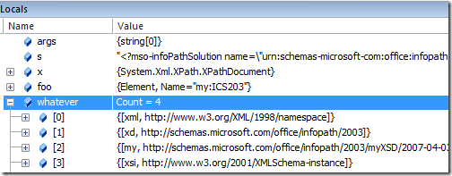
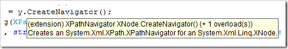
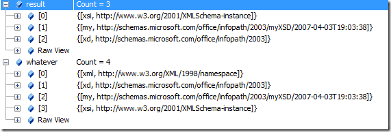

A fellow emailed me earlier asking how to get the namespaces from an XML document, but he was having trouble because the XML had some XML declarations like `<?foo?>`.

===

### System.Xml Way

XPathDocument has two cool methods, `GetNamespace(localName)` and `GetNamespaceInScope`, but they need a `currentNode` to work with.

>      string s = @"<?mso-infoPathSolution blah=""blah""?>
>                   <?mso-application progid=""InfoPath.Document"" versionProgid=""InfoPath.Document.2""?>
>                   <my:ICS203 xml:lang=""en-US"" xmlns:xsi="http://www.w3.org/2001/XMLSchema-instance"  
>                xmlns:my=""http://schemas.microsoft.com/office/infopath/2003/myXSD/2007-04-03T19:03:38""             
>                       xmlns:xd=""http://schemas.microsoft.com/office/infopath/2003"">
>                   <my:HeaderData/></my:ICS203>";
>     
>      XPathDocument x = new XPathDocument(new StringReader(s));
>      XPathNavigator foo = x.CreateNavigator();
>      foo.MoveToFollowing(XPathNodeType.Element);
>      IDictionary<string, string> whatever = foo.GetNamespacesInScope(XmlNamespaceScope.All);

Once you're on the right note, in this case the first element, you can call GetNamespacesInScope and get a nice dictionary that has what you need inside it.

I really like the `System.Xml` APIs, they make me happy.

### A System.Xml + LINQ To XML bridge methods way

How could we do this with the LINQ to XML namespace? Well, pretty much the same way with a much nicer first line (yes, this could be made smaller).

>     XDocument y = XDocument.Parse(s);
>     XPathNavigator poo = y.CreateNavigator();
>     poo.MoveToFollowing(XPathNodeType.Element);
>     IDictionary<string, string> dude = foo.GetNamespacesInScope(XmlNamespaceScope.All);

Notice that the `CreateNavigator` hanging off of `XDocument` is actually an extension method that is there because we included the `System.Xml.XPath` namespace. There are a whole series of "bridge" methods that make moving between LINQ to XML APIs and `System.Xml` APIs seamless.

See the (extension) there in the tooltip? There's also a different icon for extension methods when they show up in Intellisense. See the small blue-arrow added next to `CreateNavigator`?

These helper methods are "spot-welded" on to existing object instances when you import a namespace that defines them. They are also called 'mixins.'

### A purely LINQ To XML Way
I also wanted to see how this could be done using LINQ to XML proper.

 Disclaimer: We are comparing Apples and Oranges here, so say, "wow that query is not as terse or compact as `GetNamespacesInScope`." We're comparing one layer of abstraction to a lower one. We could certainly make a mixin for `XElements` called `GetNamespacesInScope` and we'd be back where we started. The `System.Xml` method `GetNamespacesInScope` is hiding all the hard work.

First we load the XML into an `XDocument` and ask for the attributes hanging off the root, but we just want namespace declarations.

>     XDocument z = XDocument.Parse(s);
>     var result = z.Root.Attributes().
>             Where(a => a.IsNamespaceDeclaration).
>             GroupBy(a => a.Name.Namespace == XNamespace.None ? String.Empty : a.Name.LocalName,
>                     a => XNamespace.Get(a.Value)).
>             ToDictionary(g => g.Key, 
>                          g => g.First());

Then we group them by namespace. Note the ternary operator ?: that returns "" for no namespace, else the namespaces local name as the key selector, and then gets an actual `XNamespace`.

Update: I was calling `z.Root.AncestorsAndSelf.Attributes`, and I only needed to call `z.Root.Attributes`, or if I wanted to get all namespaces, `z.Root.DescendantsAndSelf()`.

"`z.Root.AncestorsAndSelf()` says: from the root element of the document find all ancestors and the element itself. In other words only the root element. If you want to find the in-scope namespace declarations for a given element ‘e’, then on that element you’ll do `e.AncestorsAndSelf()`. In other words, starting from the given element ‘e’ walking up the ancestors path and including the element itself look for attributes that are namespace declarations and build a dictionary … Note that the question for in-scope namespace declarations is answered by walking up a path in the tree and not by doing a full traversal of the tree starting from a given point (a la `e.DescendantsAndSelf()`)."

It can be confusing to figure out the various types of these variables like "a" and "g". In this example, "a" is an `XAttribute` because the call to `Attributes()` is of `IEnumerable<XAttribute>` and g is of type `IGrouping<string, XNamespace>`, gleaned from the expression inside of `GroupBy()`.

We finish it off by taking the `IGrouping` and turning it into a dictionary with `ToDictionary`, selecting an appropriate key and the first At runtime "g" is an instance of `System.Linq.Lookup<string, XNamespace>`.Grouping which implements `IGrouping`, containing the namespace as an (and the only) element, subsequently retrieved with a call to `First()` and becomes the value side of the dictionary item.

Do also note one subtle detail. The `System.Xml` call to `GetNamespacesInScope` always includes the xmlns:xml namespace, declared implicitly. The LINQ query doesn't include this implicit namespace. Note also that these were sourced from XML Attributes and that the order of attributes is undefined (another way to say this is that attributes have no order.)

### Mirror from
[Scott Hanselman - Get namespaces from an XML Document with XPathDocument and LINQ to XML - https://www.hanselman.com/blog/GetNamespacesFromAnXMLDocumentWithXPathDocumentAndLINQToXML.aspx](https://www.hanselman.com/blog/GetNamespacesFromAnXMLDocumentWithXPathDocumentAndLINQToXML.aspx)