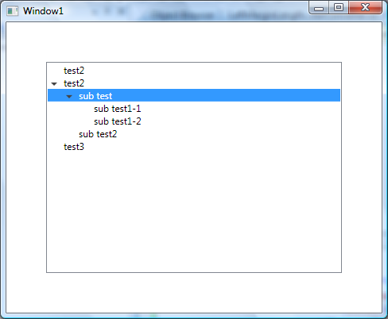

If I set TreeViewItem Background it highlights the header only. How can I highlight the whole line?

===

### Solution

I'm sure there are many ways of doing this, but this method uses a Length Converter and a TreeViewItem extension method to get the Depth. Both of these are tightly coupled to the TreeViewItem visual tree, so if you start messing with the Templates then you may have troubles.

>     <ControlTemplate TargetType="{x:Type TreeViewItem}">
>       <ControlTemplate.Resources>
>           <local:LeftMarginMultiplierConverter Length="19" x:Key="lengthConverter" />
>       </ControlTemplate.Resources>
>       <StackPanel>
>             <Border Name="Bd"
>               Background="{TemplateBinding Background}"
>               BorderBrush="{TemplateBinding BorderBrush}"
>               BorderThickness="{TemplateBinding BorderThickness}"
>               Padding="{TemplateBinding Padding}">
>                 <Grid Margin="{Binding Converter={StaticResource lengthConverter},
>                         RelativeSource={RelativeSource TemplatedParent}}">
>     
>                     <Grid.ColumnDefinitions>
>                         <ColumnDefinition Width="19" />
>                         <ColumnDefinition />
>                     </Grid.ColumnDefinitions>
>                     <ToggleButton x:Name="Expander"
>                         Style="{StaticResource ExpandCollapseToggleStyle}"
>                         IsChecked="{Binding Path=IsExpanded,
>                         RelativeSource={RelativeSource TemplatedParent}}"
>                         ClickMode="Press"/>
>     
>                     <ContentPresenter x:Name="PART_Header"
>                         Grid.Column="1"
>                         ContentSource="Header"
>                         HorizontalAlignment="{TemplateBinding HorizontalContentAlignment}"/>
>                 </Grid>
>           </Border>
>           <ItemsPresenter x:Name="ItemsHost" />
>         </StackPanel>
>         <!-- Triggers -->
>     </ControlTemplate>

#### TreeViewDepth Extension

    
>     public static class TreeViewItemExtensions
>     {
>         public static int GetDepth(this TreeViewItem item)
>         {
>             TreeViewItem parent;
>             while ((parent = GetParent(item)) != null)
>             {
>                 return GetDepth(parent) + 1;
>             }
>             return 0;
>         }
>     
>         private static TreeViewItem GetParent(TreeViewItem item)
>         {
>             var parent = VisualTreeHelper.GetParent(item);
>             while (!(parent is TreeViewItem || parent is TreeView))
>             {
>                 parent = VisualTreeHelper.GetParent(parent);
>             }
>             return parent as TreeViewItem;
>         }
>     }

#### LeftMarginMultiplierConverter

>     public class LeftMarginMultiplierConverter : IValueConverter
>     {
>         public double Length { get; set; }
>     
>         public object Convert(object value, Type targetType, object parameter, CultureInfo culture)
>         {
>             var item = value as TreeViewItem;
>             if (item == null)
>                 return new Thickness(0);
>     
>             return new Thickness(Length * item.GetDepth(), 0, 0, 0);
>         }
>     
>         public object ConvertBack(object value, Type targetType, object parameter, CultureInfo culture)
>         {
>             throw new System.NotImplementedException();
>         }
>     }

#### Control
    

>     <TreeView Margin="50" HorizontalContentAlignment="Stretch">
>         <TreeViewItem Header="test2"/>
>         <TreeViewItem Header="test2">
>             <TreeViewItem Header="sub test">
>                 <TreeViewItem Header="sub test1-1"/>
>                 <TreeViewItem Header="sub test1-2"/>
>             </TreeViewItem>
>             <TreeViewItem Header="sub test2"/>
>         </TreeViewItem>
>         <TreeViewItem Header="test3"/>
>     </TreeView>

#### Full TreeViewItem style

>     <SolidColorBrush x:Key="GlyphBrush" Color="#444" />
>     
>     <!--=================================================================
>          TreeViewItem
>       ==================================================================-->
>     
>     
>     
>     
>     

    

### Mirror from
[StackOverflow - Highlight whole TreeViewItem line in WPF - https://stackoverflow.com/questions/664632/highlight-whole-treeviewitem-line-in-wpf/672123#672123](https://stackoverflow.com/questions/664632/highlight-whole-treeviewitem-line-in-wpf/672123#672123)