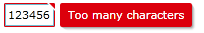
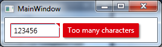

By default, the `Validation.ErrorTemplate` in WPF is just a small red border without any ToolTip.

In Silverlight 4, the validation error is nicely styled out-of-the-box.

Here is a comparison of a validation error occuring in Silverlight 4 and WPF

Silverlight 4

WPF

Notice the really flat, boring look of the WPF version compared to the, in my opinion, great look in Silverlight.

Does any similar validation styles/templates exist in the WPF Framework or has anybody created nicely styled validation templates like the Silverlight version above? Or will I have to create them from scratch?

If anybody wants to try it out, the validation error above can be reproduced with the following code, works for both Silverlight and WPF

`MainWindow/MainPage.xaml`

>     <StackPanel Orientation="Horizontal" Margin="10" VerticalAlignment="Top">
>         <TextBox Text="{Binding Path=TextProperty, 
>                Mode=TwoWay, ValidatesOnExceptions=True}"/>
>         <Button Content="Tab To Me..." Margin="20,0,0,0"/>
>     </StackPanel>

`MainWindow/MainPage.xaml.cs`

>     public MainWindow/MainPage()
>     {
>         InitializeComponent();
>         this.DataContext = this;
>     }
>     
>     private string _textProperty;
>     public string TextProperty
>     {
>         get { return _textProperty; }
>         set
>         {
>             if (value.Length > 5)
>             {
>                 throw new Exception("Too many characters");
>             }
>             _textProperty = value;
>         }
>     }

===

### Solution

I studied the Silverlight version of the Validation Error Template and created a WPF version of it which looks like this:

Added an animated GIF at the bottom of the post but after I finished it I noticed that it might be annoying because of the moving mouse in it. Let me know if I should remove it.. :)

I used a `MultiBinding` with a `BooleanOrConverter` to show the "tooltip-error" when the `TextBox` has Keyboard focus or the Mouse is over the upper right corner. For the fade-in animation I used a `DoubleAnimation` for the `Opacity` and a `ThicknessAnimation` with a `BackEase/EaseOut EasingFunction` for the Margin

Useable like this

>     <TextBox 
>          Validation.ErrorTemplate="{StaticResource errorTemplateSilverlightStyle}" />

`errorTemplateSilverlightStyle`

>     <ControlTemplate x:Key="errorTemplateSilverlightStyle">
>         <StackPanel Orientation="Horizontal">
>             <Border BorderThickness="1" BorderBrush="#FFdc000c" CornerRadius="0.7"
>                     VerticalAlignment="Top">
>                 <Grid>
>                     <Polygon x:Name="toolTipCorner"
>                              Grid.ZIndex="2"
>                              Margin="-1"
>                              Points="6,6 6,0 0,0" 
>                              Fill="#FFdc000c" 
>                              HorizontalAlignment="Right" 
>                              VerticalAlignment="Top"
>                              IsHitTestVisible="True"/>
>                     <Polyline Grid.ZIndex="3"
>                               Points="7,7 0,0" Margin="-1" HorizontalAlignment="Right" 
>                               StrokeThickness="1.5"
>                               StrokeEndLineCap="Round"
>                               StrokeStartLineCap="Round"
>                               Stroke="White"
>                               VerticalAlignment="Top"
>                               IsHitTestVisible="True"/>
>                     <AdornedElementPlaceholder x:Name="adorner"/>
>                 </Grid>
>             </Border>
>             <Border x:Name="errorBorder" Background="#FFdc000c" Margin="1,0,0,0"
>                     Opacity="0" CornerRadius="1.5"
>                     IsHitTestVisible="False"
>                     MinHeight="24" MaxWidth="267">
>                 <Border.Effect>
>                     <DropShadowEffect ShadowDepth="2.25" 
>                                       Color="Black" 
>                                       Opacity="0.4"
>                                       Direction="315"
>                                       BlurRadius="4"/>
>                 </Border.Effect>
>                 <TextBlock Text="{Binding ElementName=adorner,
>                                           Path=AdornedElement.(Validation.Errors)[0].ErrorContent}"
>                            Foreground="White" Margin="8,3,8,3" TextWrapping="Wrap"/>
>             </Border>
>         </StackPanel>
>         <ControlTemplate.Triggers>
>             <DataTrigger Value="True">
>                 <DataTrigger.Binding>
>                     <MultiBinding Converter="{StaticResource BooleanOrConverter}">
>                         <Binding ElementName="adorner" Path="AdornedElement.IsKeyboardFocused" />
>                         <Binding ElementName="toolTipCorner" Path="IsMouseOver"/>
>                     </MultiBinding>
>                 </DataTrigger.Binding>
>                 <DataTrigger.EnterActions>
>                     <BeginStoryboard x:Name="fadeInStoryboard">
>                         <Storyboard>
>                             <DoubleAnimation Duration="00:00:00.15"
>                                              Storyboard.TargetName="errorBorder"
>                                              Storyboard.TargetProperty="Opacity"
>                                              To="1"/>
>                             <ThicknessAnimation Duration="00:00:00.15"
>                                                 Storyboard.TargetName="errorBorder"
>                                                 Storyboard.TargetProperty="Margin"
>                                                 FillBehavior="HoldEnd"
>                                                 From="1,0,0,0"
>                                                 To="5,0,0,0">
>                                 <ThicknessAnimation.EasingFunction>
>                                     <BackEase EasingMode="EaseOut" Amplitude="2"/>
>                                 </ThicknessAnimation.EasingFunction>
>                             </ThicknessAnimation>
>                         </Storyboard>
>                     </BeginStoryboard>
>                 </DataTrigger.EnterActions>
>                 <DataTrigger.ExitActions>
>                     <StopStoryboard BeginStoryboardName="fadeInStoryboard"/>
>                     <BeginStoryboard x:Name="fadeOutStoryBoard">
>                         <Storyboard>
>                             <DoubleAnimation Duration="00:00:00"
>                                              Storyboard.TargetName="errorBorder"
>                                              Storyboard.TargetProperty="Opacity"
>                                              To="0"/>
>                         </Storyboard>
>                     </BeginStoryboard>
>                 </DataTrigger.ExitActions>
>             </DataTrigger>
>         </ControlTemplate.Triggers>
>     </ControlTemplate>

`BooleanOrConverter`    

>     public class BooleanOrConverter : IMultiValueConverter
>     {
>         public object Convert(object[] values, Type targetType, object parameter, CultureInfo culture)
>         {
>             foreach (object value in values)
>             {
>                 if ((bool)value == true)
>                 {
>                     return true;
>                 }
>             }
>             return false;
>         }
>         public object[] ConvertBack(object value, Type[] targetTypes, object parameter, CultureInfo culture)
>         {
>             throw new NotSupportedException();
>         }
>     }
    
    
    

### Mirror from
[StackOverflow - Validation Error Style in WPF, similar to Silverlight - https://stackoverflow.com/questions/7434245/validation-error-style-in-wpf-similar-to-silverlight/20394432#20394432](https://stackoverflow.com/questions/7434245/validation-error-style-in-wpf-similar-to-silverlight/20394432#20394432)