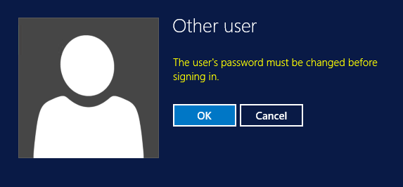

===

If your AD account has the “User must change password at next logon” option enabled:

and you try to logon to a RDP session (with correct credentials):

you might encounter this error message:

### Client side

Well, if the server allows it, you can temporary disable “Credential Security Support Provider (CredSSP)” in the RPD client. This disables Network Layer Authentication, the pre-RPD-connection authentication, and therefore enables you to change your password via RDP. CredSSP is enabled by default in the RDP client on Windows Vista and forward.

There is no option to disable CredSSP in the RDP client, so here is how you have to do it:

* Start mstsc.exe
* Click Show Options
* Click Save As

* Call it **ChangePassword.rpd** (or anything you’d like, but avoid the name **Default.rdp**)
* Open the saved **ChangePassword.rpd** in Notepad
* Add a new row at the end with the following text:
**enablecredsspsupport:i:0**

* Save the rdp file
* Double-click the rdp file
* Enter the name/IP of a domain connected computer with RDP enabled

Instead of the local Windows Security prompt (the second image in the blog post) you should see a Windows Logon screen on the remote computer (if not, read on anyway):

If the account you log on with at this point has the “User must change password at next logon” option enabled, you get notified about that:

By clicking OK, you have the possibility to change the password.
After changing the password you get confirmation about the change.

Clicking OK logs you in.

([Source: https://mssec.wordpress.com/2015/12/26/forced-password-change-at-next-logon-and-rdp/](https://mssec.wordpress.com/2015/12/26/forced-password-change-at-next-logon-and-rdp/)