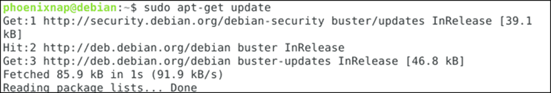

SSH stands for Secure Shell. SSH is used for connecting to a remote computer accessing files and perform administrative tasks.

In this tutorial, learn how to enable SSH on Debian 9 (Stretch) or Debian 10 (Buster).

===

### Prerequisites
* Debian system to act as an SSH server
* Debian system to act as an SSH client
* sudo privileges on Debian for each system
* Access to a command line (Ctrl-Alt-T)
* Apt package manager(included by default)

### Step 1: Update the Package Manager

Before installing new software, update the software repository list with the following command:

>     sudo apt-get update

The screen confirms that the packages have been updated:

### Step 2: Install SSH Server

On the system that acts as a server, run the following command:

>     sudo apt install openssh-server

Enter your password when prompted, then press Y to continue the installation. In this case, the output states that the newest version is already installed.

You can check the status of the SSH service with the following command:

>     sudo systemctl status ssh

The system confirms that the SSH service is running.

### Step 3: Start and Stop the SSH Server

Since SSH controls connections, it can be handy to know how to start and stop the service.

To stop the SSH host server, enter the following:

>     sudo service ssh stop

If you check the status of the service at this point the system indicates that SSH is inactive. It also indicates the exact date and time it stopped.

To start the SSH service, use the following command:

>     sudo service ssh start

Stopping the service only lasts until the next reboot.

To turn off SSH indefinitely, enter:

>     sudo systemctl disable ssh

To re-enable the SSH service, simply replace disable with enable.

### Step 4: Get Your Server IP Address

If you’re configuring a server locally, you can display the IP address from a terminal window with the following command:

>     ip a

The IP address will be in a format like this:

>     192.168.0.1

If you’re connecting to a server that’s already configured, you’ll want to get the IP address from the server’s administrator. Or, you can log in using the server’s hostname or domain name.

### Connecting to a Server Using SSH

Enter the following command to connect to the server using a secure shell:

>     ssh UserName@IPAddressOrHostname

Replace the UserName with the username of an authorized user on the server. After the @ sign, use the IP address from Step 4, or you can use the domain name. You can also specify a hostname if the server is configured to use one.

When connecting for the first time, the system may prompt you for confirmation. Type ‘yes‘ and then ‘enter‘.

The remote system will prompt you for a password. Use the password that goes with the username you’ve provided.

The command prompt will change to username@hostname, indicating that the commands you are running are being executed on the remote server.

To make your SSH secure, [please check other SSH articles from the blog.](https://pegazus.space/tag:SSH)

(Source: [https://phoenixnap.com/kb/how-to-enable-ssh-on-debian](https://phoenixnap.com/kb/how-to-enable-ssh-on-debian) )

