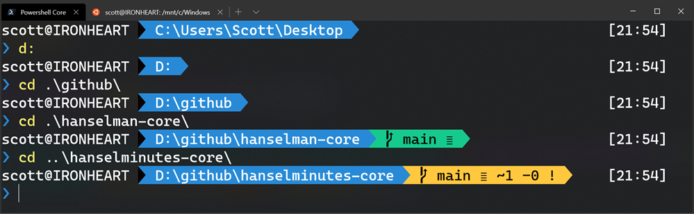
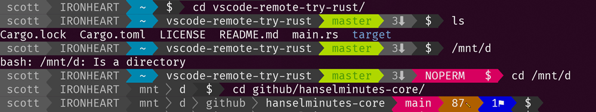
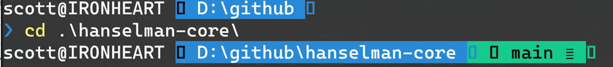

===

### Step One - Get the terminal

Get [Windows Terminal](https://www.microsoft.com/en-us/p/windows-terminal-preview/9n0dx20hk701?WT.mc_id=-blog-scottha) free from the Store. You can also [get it from GitHub's releases](https://github.com/Microsoft/Terminal?WT.mc_id=-blog-scottha) but I recommend the store because it'll stay up to date automatically.

Note that if you were an early adopter of the Windows Terminal and you've released updated beyond 0.5, I'd recommend you delete or zero-out your profiles.json and let the Terminal detect and automatically recreate your profiles.json.

### STEP TWO FOR POWERSHELL - POSH-GIT AND OH-MY-POSH

Per [these directions](https://github.com/JanDeDobbeleer/oh-my-posh), install `Posh-Git` and `Oh-My-Posh`. This also assumes you've installed [Git for Windows](https://git-scm.com/downloads).

>     Install-Module posh-git -Scope CurrentUser
>     Install-Module oh-my-posh -Scope CurrentUser

Run these commands from PowerShell or PowerShell Core. I recommend PowerShell 6.2.3 or above. You can also use PowerShell on Linux too, so be aware. When you run `Install-Module` for the first time you'll get a warning that you're downloading and installing stuff from the internet so follow the prompts appropriately.

Also get `PSReadline` if you're on PowerShell Core:

>     Install-Module -Name PSReadLine -AllowPrerelease -Scope CurrentUser -Force -SkipPublisherCheck

Then run `notepad $PROFILE` and add these lines to the end:

>     Import-Module posh-git
>     Import-Module oh-my-posh
>     Set-Theme Paradox

Now that word Paradox there is optional. It's [actually the name of a theme and you can (and should!) pick the theme that makes you happy and use that theme's name here](https://github.com/JanDeDobbeleer/oh-my-posh?WT.mc_id=-blog-scottha#themes). I like Agnoster, Paradox, or Fish, myself. Read more over here. https://github.com/JanDeDobbeleer/oh-my-posh

### Step Two for Ubuntu/WSL
There's a number of choices for Powerline or Powerline-like prompts from Ubuntu. I like Powerline-Go for it's easy defaults.

I just installed Go, then installed `powerline-go` with go get.

>     sudo apt install golang-go
>     go get -u github.com/justjanne/powerline-go

Add this to your `~/.bashrc`. You may already have a GOPATH so be aware.

>     GOPATH=$HOME/go
>     function _update_ps1() {
>         PS1="$($GOPATH/bin/powerline-go -error $?)"
>     }
>     if [ "$TERM" != "linux" ] && [ -f "$GOPATH/bin/powerline-go" ]; then
>         PROMPT_COMMAND="_update_ps1; $PROMPT_COMMAND"
>     fi

GOTCHA: If you are using WSL2, it'll be lightning fast with git prompts if your source code is in your Ubuntu/Linux mount, somewhere under `~/`. However, if your source is under `/mnt/c` or `/mnt` anywhere, the git calls being made to populate the prompt are super slow. Be warned. Do your Linux source code/git work in the Linux filesystem for speed until WSL2 gets the file system faster under /mnt.

At this point your Ubuntu/WSL prompt will look awesome as well!

### Step Three - Get a better font

If you do all this and you see squares and goofy symbols, it's likely that the font you're using doesn't have the advanced Powerline glyphs. Those glyphs are the ones that make this prompt look so cool!

[Cascadia Code](https://github.com/microsoft/cascadia-code/releases) has been updated with a PL (Powerline) Glyph version! Go get it at [https://github.com/microsoft/cascadia-code/releases](https://github.com/microsoft/cascadia-code/releases) and change the fontFace in your `settings.json` to `Cascadia Code PL`.

>     "fontFace":  "Cascadia Code PL"

Remember also you can get lots of Nerd Fonts at [https://www.nerdfonts.com/](https://www.nerdfonts.com/), just make sure you get one (or generate one!) that includes PowerLine Glyphs.

Have fun!

### Mirror from
[Scott Hanselman - How to make a pretty prompt in Windows Terminal with Powerline, Nerd Fonts, Cascadia Code, WSL, and oh-my-posh - https://www.hanselman.com/blog/HowToMakeAPrettyPromptInWindowsTerminalWithPowerlineNerdFontsCascadiaCodeWSLAndOhmyposh.aspx](https://www.hanselman.com/blog/HowToMakeAPrettyPromptInWindowsTerminalWithPowerlineNerdFontsCascadiaCodeWSLAndOhmyposh.aspx)
