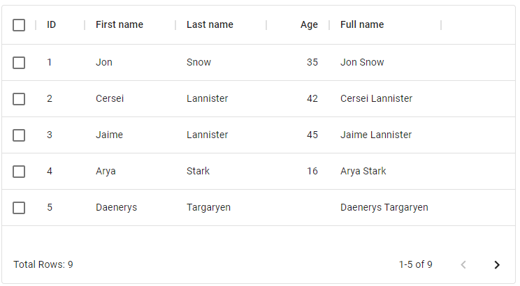
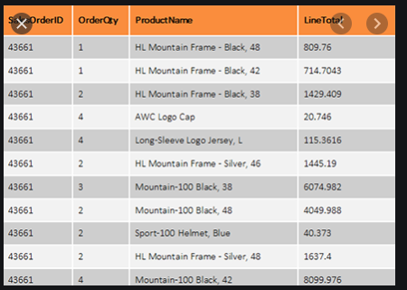

I am evaluating React-Material grid for my customer. One of the key feedback was the absence of alternate shading of rows, which impacts user experience.

[https://material-ui.com/components/data-grid/#mit-version](https://material-ui.com/components/data-grid/#mit-version)

Is this possible?

Actual

Desired

===

### Solution

It's pretty simple to add in via a CSS selector.

If you add a selector for the odd rows `.Mui-odd`, then you can set the color of the background and make it striped. You could use `.Mui-even` instead for the other half.

>     .MuiDataGrid-row.Mui-odd {
>       background-color: aliceblue;
>     }

If you wanted to use `:nth-child`, then you'd need `:nth-child(even)` for the same set of rows as `.Mui-odd`, though `.Mui-odd` keeps up it's ordering between pages, where the psuedo selector doesn't.

>     .MuiDataGrid-row:nth-child(even){
>       background-color: aliceblue;
>     }

### Source
    
[StackOverflow - How to make React-Material UI data grid to render rows using alternate shades?](https://stackoverflow.com/questions/64682097/how-to-make-react-material-ui-data-grid-to-render-rows-using-alternate-shades)
