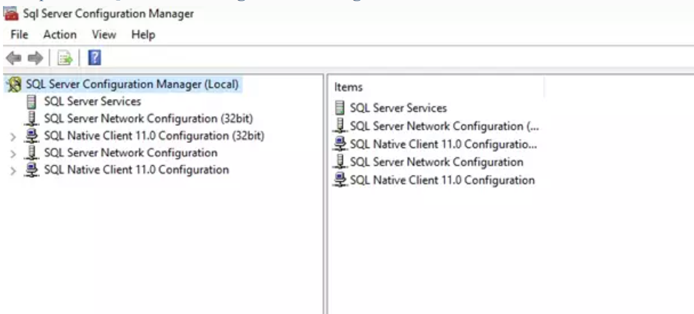
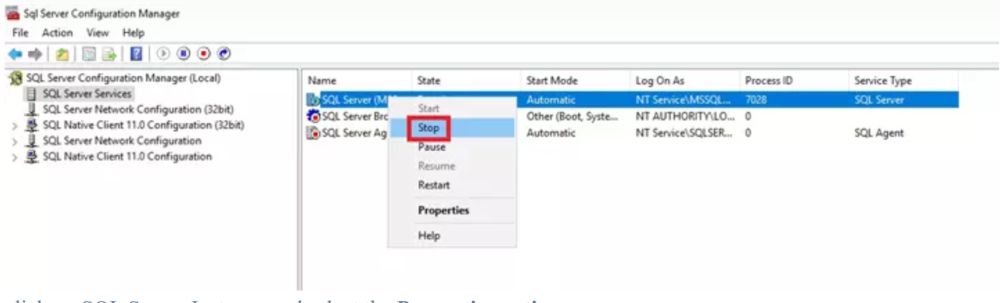
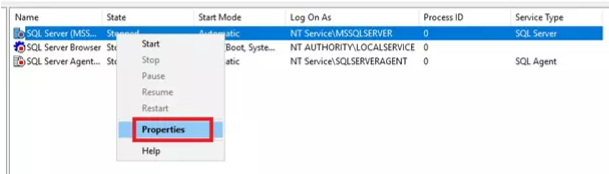
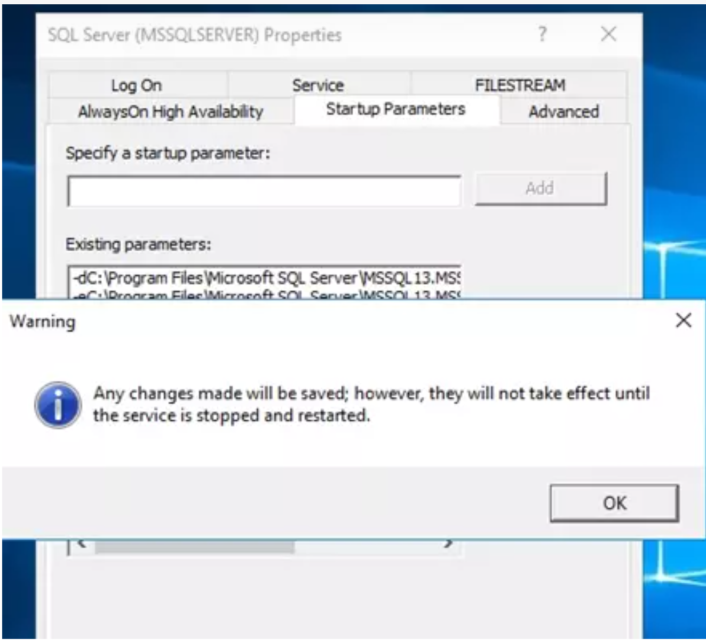

If an SA password is ever lost then instead of re-installing SQL and re-attaching the DB, SQL Server provides a great disaster recovery method that keeps objects and data in the master DB. Members of the server’s local Administrators group can reach SQL Server by starting it in single-user mode.

In this blog we will show how to recover SA password on Microsoft SQL server by starting SQL Server in single user mode when you forget `sa` credentials.

===

### Pre-requistiques
* Microsoft SQL server configured with mixed (Windows and SQL).
* User should be administrator of server.

### Steps
* Open the SQL Server Configuration manager. 

* Go to SQL Server Services and Stop the SQL Server Instance. 

* Right click on SQL Server Instance and select the Properties option. 

* Go to Startup Parameters tab, type `–m` to Specify a startup parameter and click on Add 

* Click on Apply and then OK. 

Note: If SQL server is before 2014 we could not change startup parameter but you can check the start parameter go to Advanced and check the startup parameter.

* Click OK on Warning which prompts after apply the changes in Startup Parameter. 

* Now, Start SQL Server Instance.
* Open the SQLCMD command prompt.
* Run the command `EXEC sp_addsrvrolemember ‘DOMAIN\Username (Domain username) ‘, ‘sysadmin’;`
Run the command `GO`.
* Now go to SQL Server Instance clicks on Properties.
* Go to Startup Parameters tab and remove startup parameter `–m` from Existing parameters after that click on Apply then OK.
* Now stop the SQL instance again.
* Now Open the Microsoft SQL server management.
* Use the same account which has been added above to login.
* Now expand the SQL server > Security > Logins and open the properties to reset SA account password.
* The login account added is a SQL sys admin now, so it can reset the SA password.

### Mirror from
[How To Recover SA Password On Microsoft SQL Server](https://www.hex64.net/blog/how-to-recover-sa-password-on-microsoft-sql-server/)

