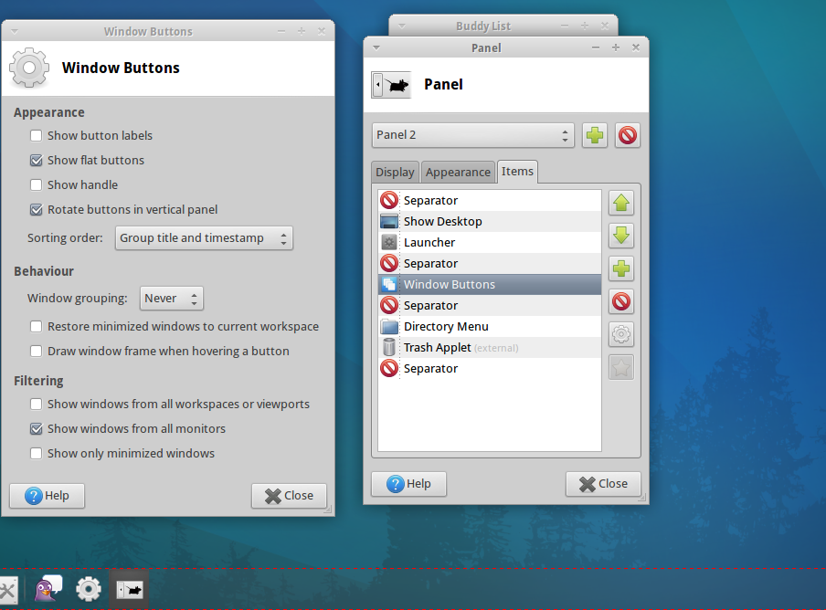

This article is dedicated to people who love to play around with there XFCE desktop (Xubuntu, Ubuntu Studio, Voyager Linux, Manjaro Linux, etc). In case you guys get stuck with any problem for xfce 4 which is not that customizable compared to the older version you can always reset it to the initial parameters.

===

Run the commands one by one written below in bold making sure that you are not the root user $

XFCE stores it’s configuration for the running session in xfconfd. Feel free to back up the files you’re going to delete first.

* Shut down the panel first

>     xfce4-panel --quit

* Kill the xfce4 configuration daemon

>     pkill xfconfd
    
* First delete settings for the panel

>     rm -rf ~/.config/xfce4/panel
    
* Clear out the settings for _xfconfd_

>     rm -rf ~/.config/xfce4/xfconf/xfce-perchannel-xml/xfce4-panel.xml
    
* Restart the panel

>     xfce4-panel
    
This will respawn xfconfd automatically. Note if you need or want to restart xfconfd manually know that on my installation it was in /usr/lib/x86_64-linux-gnu/xfce4/xfconf/xfconfd which was outside of $PATH.

This clears it for the running session, regenerates the files, and sets up the default for future sessions.

 (Source: [https://anglehit.com/how-to-reset-xfce-panels-to-default-settings/](https://anglehit.com/how-to-reset-xfce-panels-to-default-settings/) )

