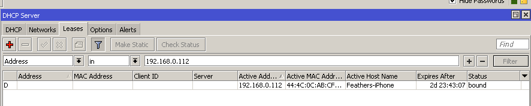
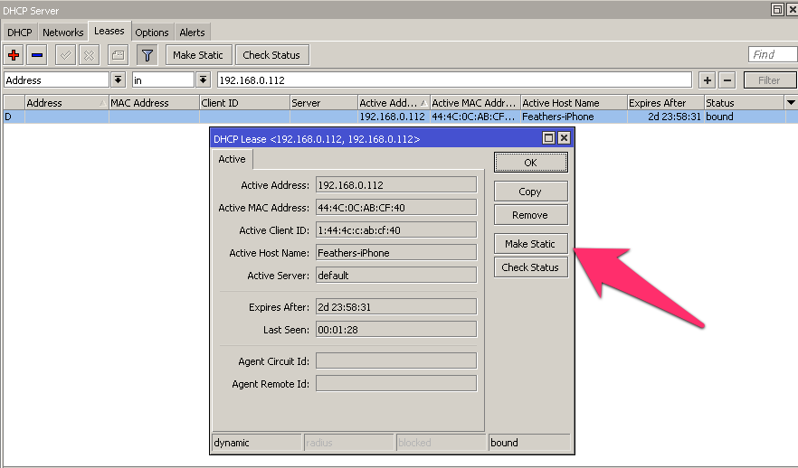
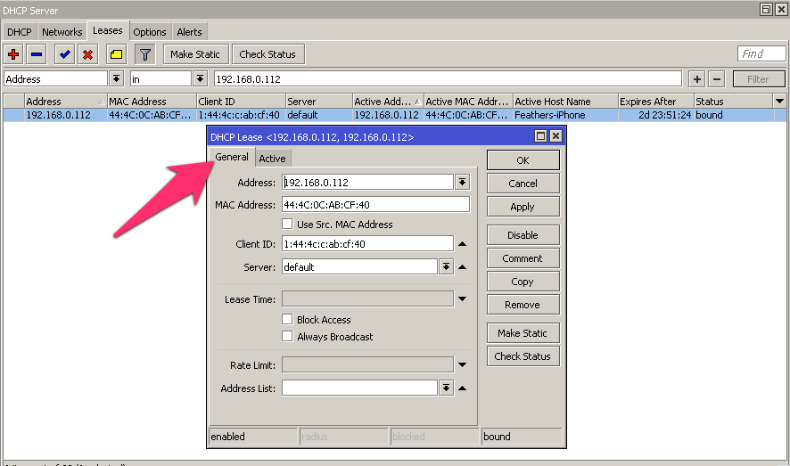
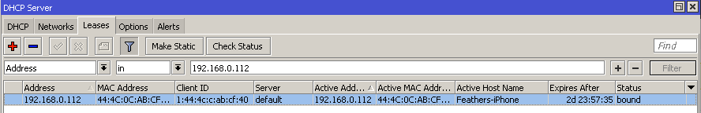

This tutorial helps you guide setting up DHCP reservations on a Mikrotik RouterOS.

===

### How to set up static DHCP reservations in WinBox
* Go to **IP**, then **DHCP-Server**
* Click on **Leases**
* Click the line that shows the IP address of the device you would like to make a DHCP Reservation for
* At this point you will be looking in the **Active Address** column, near the middle
* Click **Make Static** at the top of the window
* The **Address** and **MAC Address** columns will populate
* Double-click the device you are working on
* In **Address**, enter the permanent IP address you would like the device to have – an address outside of the DHCP range
* Click Comment and enter a description for the device.  e.g. “_front yard IP camera_”
* Click OK.
* At this point the device still has the OLD IP address that it got when it was first plugged in.
* Do whatever steps necessary to force the device to grab the new DHCP address.  This could be a reboot, pulling the network cable and plugging it back in, clicking Repair on the network connection on a PC, etc.
* The device should grab the new DHCP address.

### This is how a standard DHCP lease looks:

Double-click it and open that **DHCP Lease**’s window.  When you click “**Make Static**”, the main **DHCP Server** window will update, but the DHCP Lease window will NOT update. You have to close it and reopen it to see the “General” tab. (see pic below)

Double-click that DHCP lease to open this window, and hit **Make Static**

In the Address field on the General tab, you can type in the permanent static DHCP address you would like the device to have.  (Ideally outside your DHCP Pool so the same address doesn’t get handed out twice.)  It will not change immediately – the device will grab the new IP the next time it goes to renew its DHCP lease. You can normally force this to happen by rebooting the device or unplugging the network cable and plugging it back in.

The Address is the static DHCP reservation.  The Active Address is what the device currently has.  After a reboot/dhcp refresh the Active Address will change to what is in the Address field.  Add a Comment to make your life easier and you’re done.

Semipro tip: I sometimes enter a static DHCP reservation for devices that have a hard-coded static IP address. Even though the DHCP reservation will never be ‘active’, it will be in the list with all the DHCP devices and it’s a great reminder that “Oh yeah, I do have a device at 192.168.1.248 that I forgot about.”

(Source: http://networkingforintegrators.com/2012/08/dhcp-reservations/ )