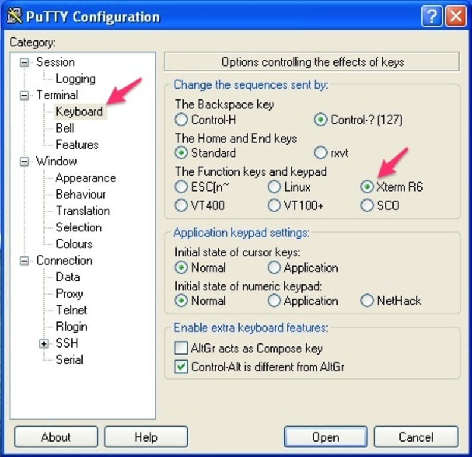

In PuTTY configuration window, take Terminal > Keyboard. Change the "Function keys and keypad" setting to "Xterm R6".

===

### Mirror from
[ezeelogin - F1 - F4 keys not working in ezsh when using PuTTY - https://www.ezeelogin.com/kb/article/4/f1-f4-keys-not-working-in-ezsh-when-using-putty-40.html](https://www.ezeelogin.com/kb/article/4/f1-f4-keys-not-working-in-ezsh-when-using-putty-40.html)