Sometimes it's fun to put the big projects aside for a while and make something small. That's not to say it can't be challenging - it's most of the time during these small endeavours that I find myself learning something new that I may have been putting off for a while. This is the joy of not having the distraction of scores of components, state, props and more.

===

A gif showing the final outcome of the project

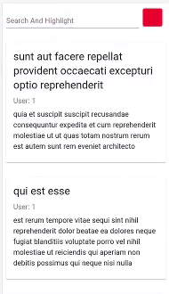

For no specific reason, I was inspired to make a dynamic search bar which does three things:

* Takes a text input

* Filters the results containing said text

* Highlighting that very text

I'd made something similar to this a long time ago in vanilla JS, but I don't remember how exactly (and chances are I won't want to).

However, it was something I hadn't needed up until now in a React project so I thought it would be a good use of time in case, you know, the time ever comes.

### Tools For The Job
Being the "bish-bash-bosh" project this was I stuck with React and React alone. OK, there's obviously some styling, but nothing more than a few imported Material UI components. This really was more about the functionality then anything else.

We will also be making use of some JSON placeholder from this JSONplaceholder website to populate our app. We're pulling from the following API:

>     https://jsonplaceholder.typicode.com/posts

This will deliver back to us an array of objects, each like so:

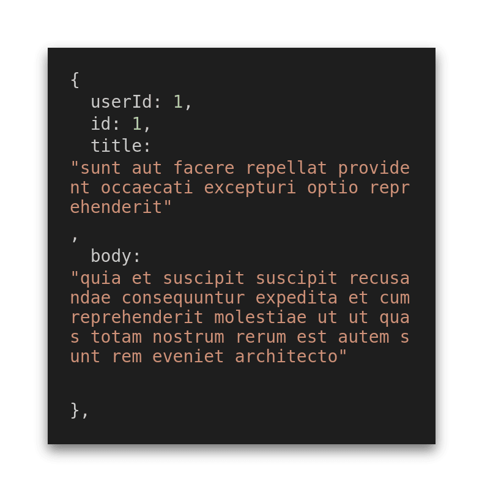

### Getting It Done
The file structure for this project is as follows:

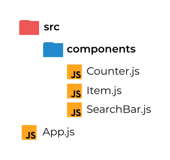

Let's go through the components before diving into `App.js`, where the bulk of our logic sits, so we can gain an understanding of what's going on in each.

Let's take a look at `Item.js`.

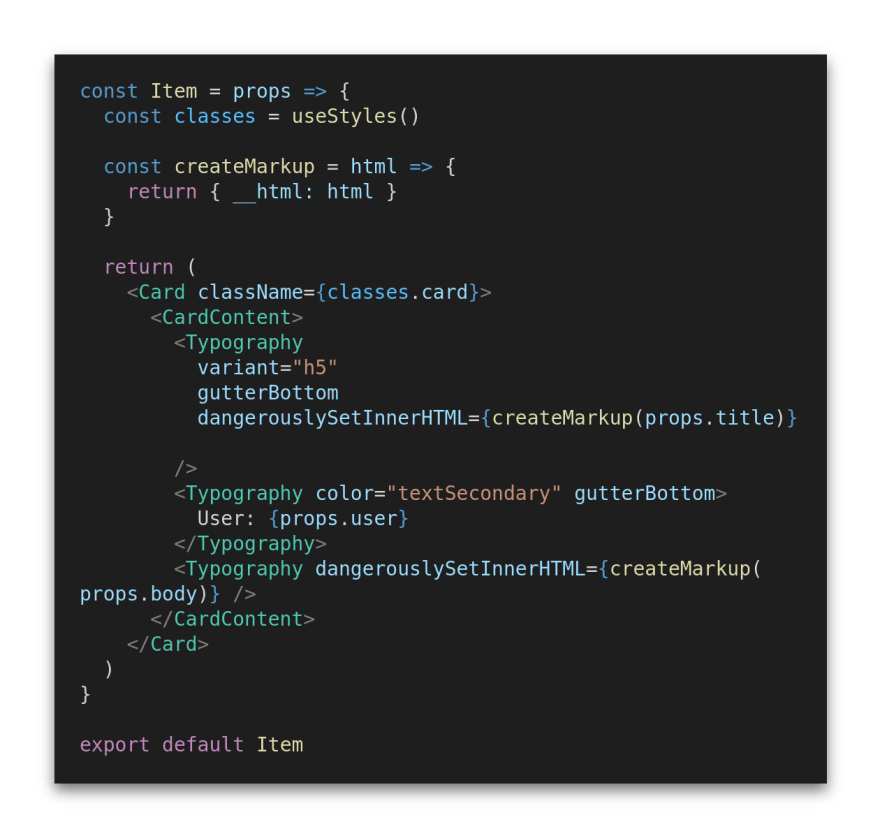

Before we move on, I just want to point out that `Card`, `CardContent`, `Typography`, and `classes.*` are all related to Material UI and not important to what's going on. You can think of them as almost any HTML element you like.

With that aside, let's look at what is important.

Well, if we were to look at this without all of the additional styling or function we would have something like this.

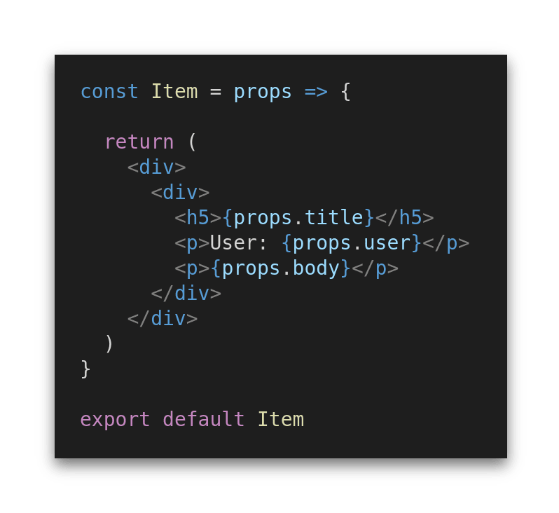

So, for the most part, this component is essentially our container for each of our objects we receive back from our JSON placeholder API. These values are being passed into the component via `props` and rendered as we choose.

We'll come back to the slightly more complex version once we've look over the rest of our components.

`SearchBar.js` is an even more compact component. Beautiful!

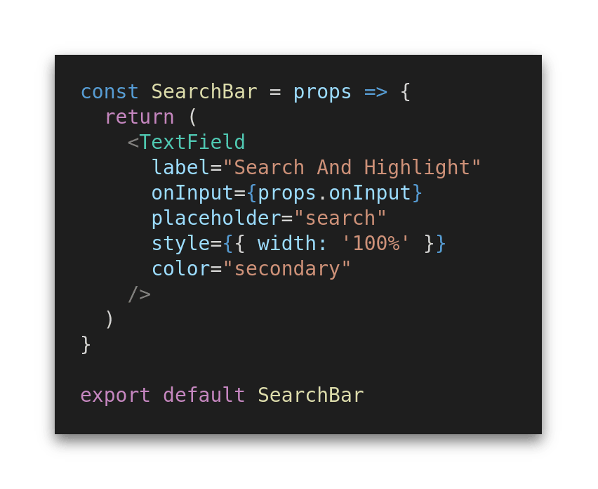

Again, please note that the `Textfield` element is a Material UI component, and could just as easily be an `input` element with the `type="text"` attribute.

The only prop that is passed to this component is via `props.onInput`, which is responsible for updating our state each time a new character is typed into or deleted from our `input` field.

Our last component is `Counter.js`. This component isn't strictly required to make this project work, however I thought it was a nice touch.

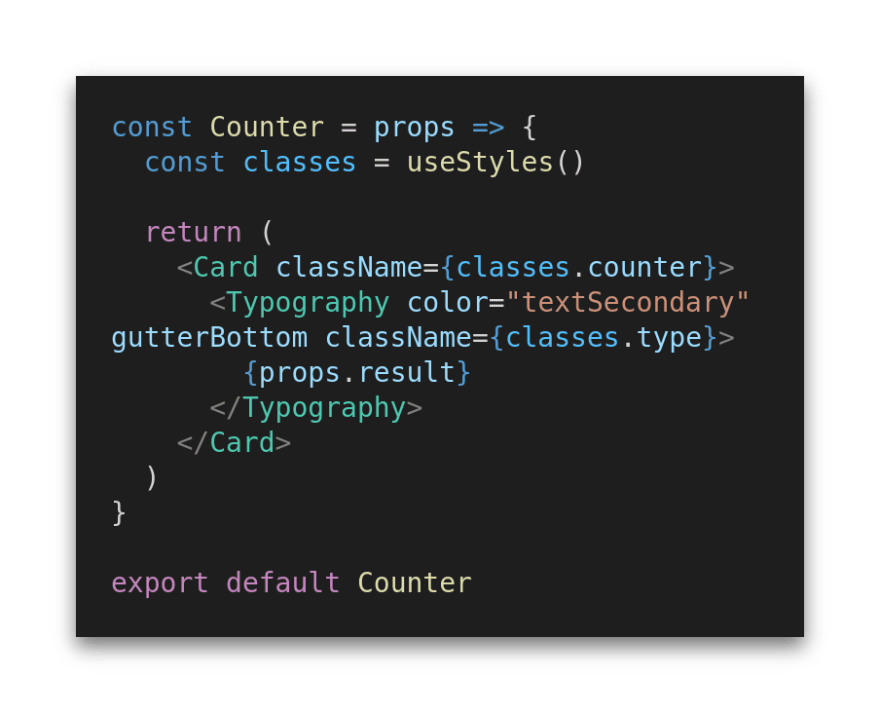

You know the deal with the Material UI stuff by now!

Only one `prop` this time. We're simple passing in a result, and we'll come back to exactly what that is very soon.

OK, it's time for the big one. Let's move on to `App.js`. For the sake of readability we'll break this down into smaller sections as it's a fair bit larger than the previous components. Not humongous, but bigger nonetheless.

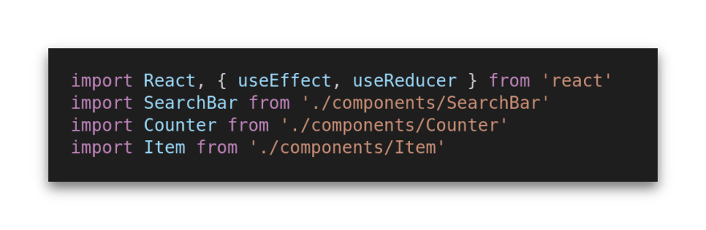

This part of the app makes use of the `useEffect` and `useReducer` hooks provided natively with ReactJS, so we'll start by importing those. We then bring in our 3 components we just went through to complete our imports.

## A Note On useReducer
As the functionality for this project was all crammed into the `App` component, I decided to opt for `useReducer` over `useState` to save from having four separate state variables, though it could just as well have been implemented that way too.

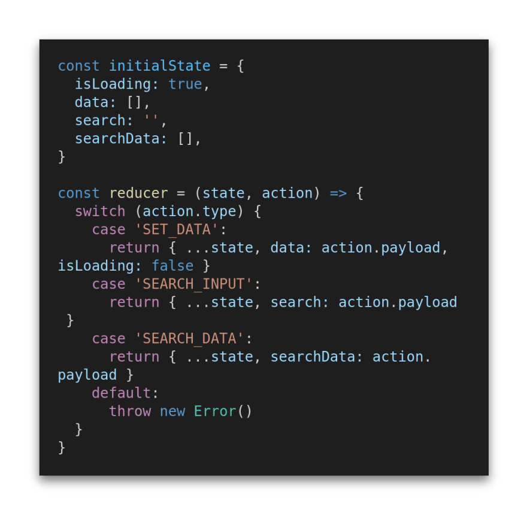

If you're familiar with `useReducer` you can skip along to the Continuing With The App section. Just take note of the code above and the coming snippets.

We start by declaring our `initialState` for the component which consists of four different keys - so what are they for?

* `isLoading` accepts a boolean value to essentially let our app know whether the async function has completed or not - or is loading.

* `data` will be our store for the array we receive back from our API call.

* `search` will hold the string which is entered into the SearchBar component.

* `searchData` will be a filtered version of our data state array. This will remain an empty array until something is entered into the search input.

Our `reducer` function is the tool we use to alter or update our state object as necessary. A note here, you should declare both your `initialState` object and reducer function outside of the component itself. If you are familiar with how `useState` works then you're in a good position to understand `useReducer` as the two are very similar. I'll explain how.

I mentioned before that this could have just as easily been implemented with `useState` over `useReducer`, and here's an example of how the two compare. Both of the code examples below have one thing in common - in the `useReducer` example the `dataTwo` and `isLoading` key/values are able to hold the exact same information as the `dataOne` and `isLoading` variables in the `useState` example. This comes as no surprise as this is plain JavaScript. The difference between them comes in how the state is updated.

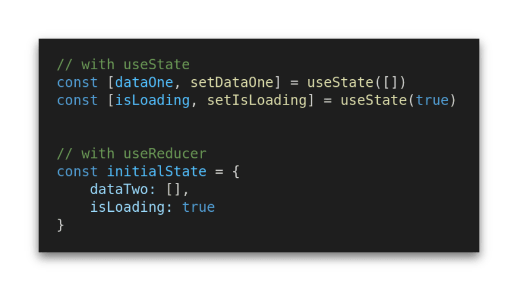

With `useState` we are provided a function, which we name, as a return value from `useState()`. This function is how we update the value of state, for example `setData(data)` would update our data state to contain (in this example) the array returned from our API call, and then we could call `setIsLoading(false)` which would update the `isLoading` variable from true to false.

With `useReducer` we need to provide a reducer function (which we did in our code snippet above) to update the state object. This has the added benefit of being able to update multiple states at once. Take a look at `case "SET_DATA":` in our snippet.

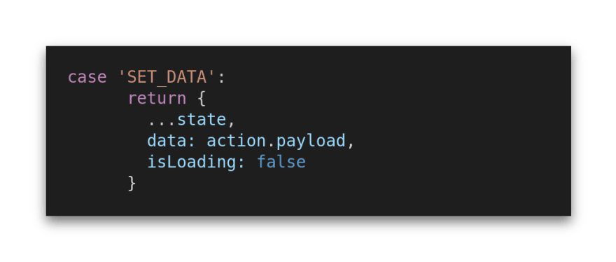

In the return value we start by passing in the initial state using the ES6 spread operator. This essentially ensures we start where we left off and pass all existing state values back into the object we want to return. We then pass in the key/value pair of data: `action.payload`. This updates the current value of data to the one which we pass in when we call the reducer function (which we'll come to soon). In the same return, we are also able to update `isLoading` to false to end the loading sequence.

All that's left to do is use the `useReducer` function like so :

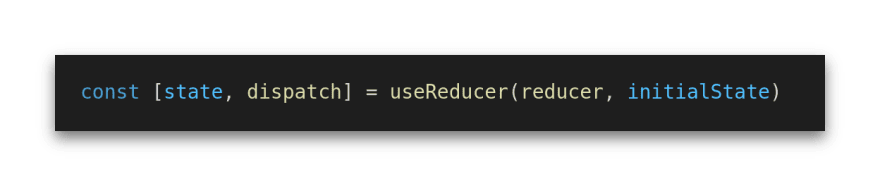

This gives us access, in the same was as `useState`, to our `initalState` (and object in this case stored in the state variable) and a function to update our state (in this case stored in dispatch). We pass in our reducer function and `intialState` and we are ready to go! We can now call dispatch in our component which will fire off our reducer function and update our `initialState` object:

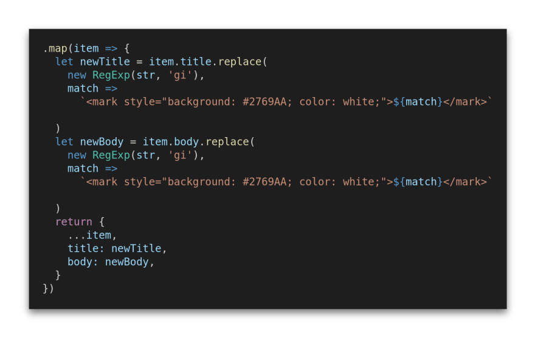

We need to pass in the "type" of update we wish to be carried out and, where applicable, the "payload" for the update. type is determined in the switch statement of the reducer function, and payload is a fancy word for the data we want to store there (be it an array, boolean, string, etc.) And that's state updated!

Hopefully, you can see how `useReducer` could be beneficial. As the complexity of your app and its state grow, and the relationship between those states becomes stronger, you will inevitably find that `useReducer` is superior in handling the growing workload. Of course, you would likely want to incorporate a level of error checking to this but for the sake of this project this was sufficient.

### Continuing with the App

Now we've got a home for our state and the ability to update it we can move on to the functionality. I won't go into how the data is fetched from the API, there are a million tutorials, blog posts and docs on that. All that you will want to know is that we use the dispatch example above to get that data into our state.

The return statement for our `App` component contains our `SearchBar`, `Counter`, and `Item` components. Let's go through each one and start connecting the dots.

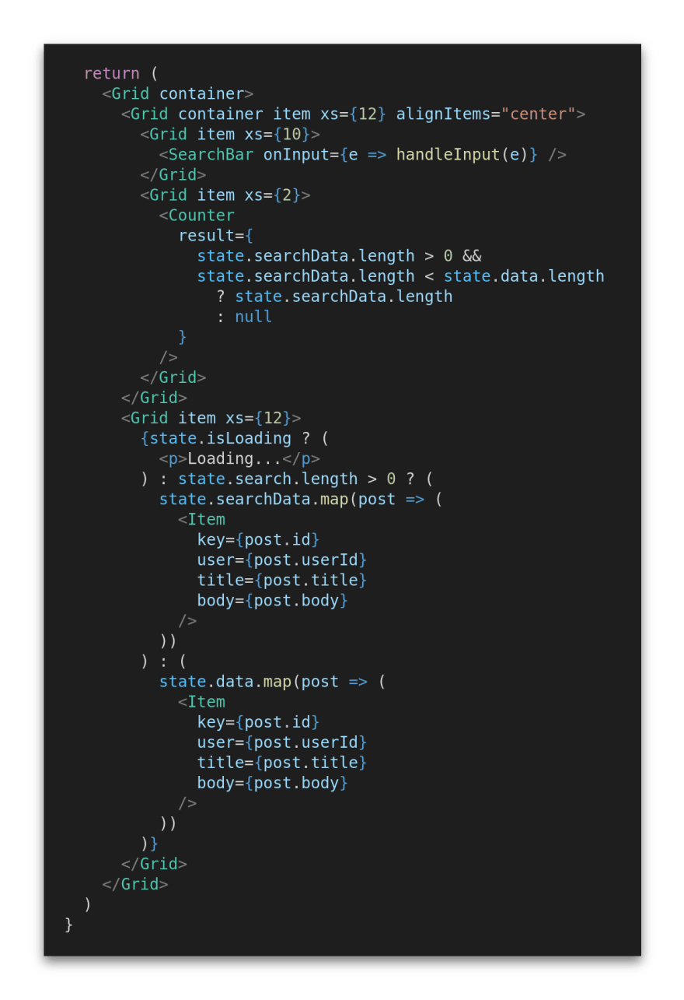

We'll start with our `SearchBar` component and the function that is called within its `onInput` attribute. As you'll remember, we passed a prop down to this component via `props.onInput` and this allows us to call the following function when we type something into our text input:

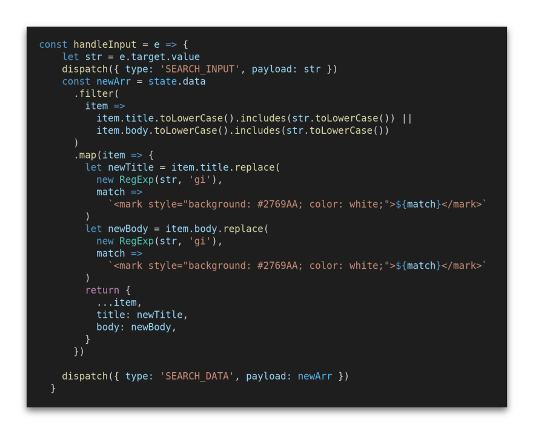

Woah! That's a lot of code for an input. Well, this function does a little more that just deal with the input itself. Let's deal with that first though, and it's a pretty small part of the function.

On the second line of the function we declare a variable `str` and assign it `e.target.value` which simply keeps the string as it is entered into the input field. On the following line we call our dispatch function (go back through the A Note On `useReducer` section if you've no idea what that means) and pass the type of `'SEARCH_INPUT'` and payload the value of `str`. This, together, updates our state to always store the most up-to-date string in the input field.

The next part of the function deals with the filtering of our data array, stored in `state.data`. We make use of the JavaScript `.filter()` method to iterate through the title and body values of our objects and see if the text in our `str` variable is included (using JavaScripts `.include()` method anywhere in their respective string. The addition of the `.toLowerCase()` method ensures that no matter what casing we use when we type into the search bar, if the letters themselves match our filtering will be successful. Without this a search for "Hello World" would not return the result "hello world" - and we don't want to be that pedantic with our users!

One of the many great thing about JavaScripts array methods is the ability to chain them together. In this instance, we can then call the `.map()` method on `state.data` to iterate though each of the filtered objects and apply our highlighting.

### Highlight: the Highlight

This took me a great many attempts to get right, and part of me wishes I could have found a way to do it using only the strings themselves, however I had to call upon the dreaded `dangerouslySetInnerHTML` to make this work.

At the beginning of this article I showed you the following code:

This is our `Item` component, and you've likely noticed that two of the elements make use of `dangerouslySetInnerHTML` to populate themselves. If you want to read more about `dangerouslySetInnerHTML` then I suggest checking out the official docs. However, we will make the assumption in our case that we trust our source and the content it provides.

The `createMarkup` function returns an object with the key of `__html` and value of the HTML itself, as recommended in the React docs, and this value is used to set the inner HTML of each element. This approach turned out to be necessary to be able to inject a `<mark>` element into the string to function as our highlighter.

We will be making use of JavaScript's `.replace()` method to highlight our strings, therefore we start by declaring a new variable for the value we will have returned to us by this method. `.replace()` takes in two arguments, the first of which is the pattern which we want replaced. This could simply be a string or, as is our approach, a RegExp. The RegExp itself takes two arguments - firstly the string (or pattern) we want to identify, and secondly some options (or flags) to give the RegExp some guidance on what we want done. In our case we pass the string "gi". This does two things. The g tells the RegExp that we want to search the entire string and return all matches, and the i that our search should be case-insensitive and without this, like if we were to omit the `.toLowerCase()` method from our filter, we would not highlight words regardless of their case.

One the has RegExp has identified the characters we would like to replace it moves on to the second argument in the `.replace()` method, which is the what should replace that. This is where and why our use of `dangerouslySetInnerHTML` was necessary as we are inserting the `<mark>` tag back into our object. Without this we would actually render the characters around our string on the screen.

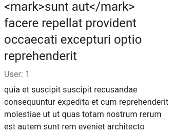

Not pretty.

This second argument is a function with the parameter of match. This allows us to re-purpose our original string, wrap it in the new HTML element, and return it. These new values are now the values stored in the `newTitle` and `newBody` variables. We can now simply return these back into the newArr constant in our return statement, being careful not to overwrite our original object values using the spread operator:

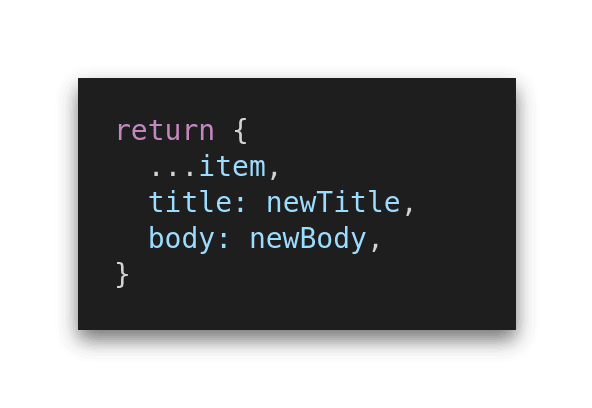

The final piece to this function is to dispatch our new array `newArr` of filtered and highlighted objects into our state.

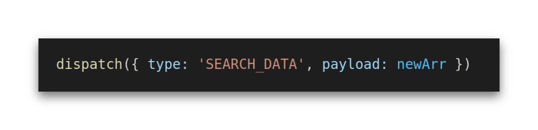

Now all that's left is to render the results.

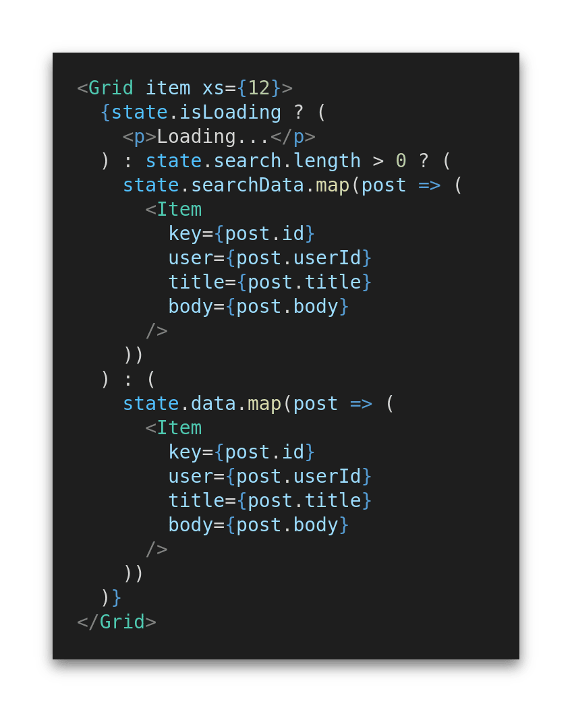

This nested ternary operator asks two questions to decide what to do. Firstly, have you finished loading yet? Yes? Right! Then, have you typed anything into the search field `(state.search.length > 0 ?)`? Yes? In which case, I'll run through everything that's now in `state.searchData` (including their new title and body values and their `<mark>` elements you filtered out) and generate your Items for you.

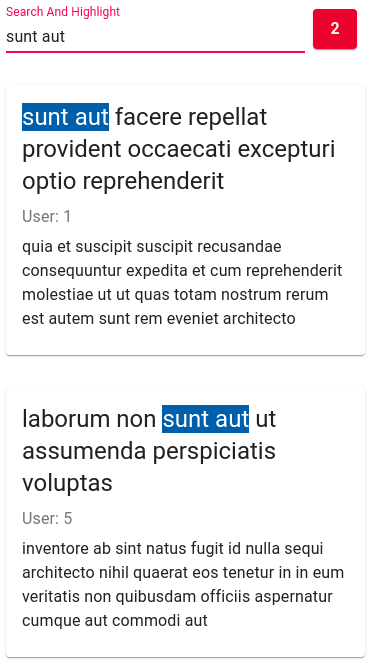

Voila! Would you look at that!

And if there isn't anything in the search bar? Well then, I'll just render everything you have stored in `data`. This is completely unfiltered and untouched.

But, what happens if I do type something into the search but it doesn't have any matches? Well, typing into `SearchBar` will mean that our ternary operator will see that there are characters in our `state.searchand` render everything in the array...nothing!

### A Little Something Extra

The counter shown in the examples above is more of a nice to have, but in some cases it might be useful to give the user some idea of how may items they have filtered down to. For example, typing the string "aut" into my search gives me 66 matches. Maybe I could be more specific before trying to scroll through all of that data. Oh yeah, "aut facere" gives me only 2 results! Great.

This is a simple little component which simply gets passed the length of the `state.searchData` array (or nothing, if there isn't anything, to save displaying 0 all of the time).

Here's the component itself:

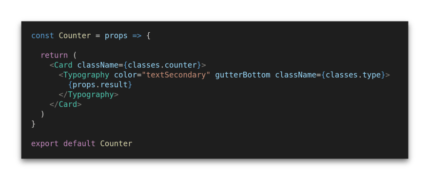

And its implementation into `App.js`:

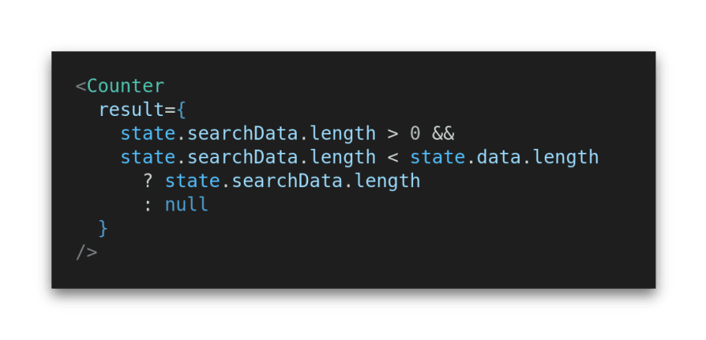

And that’s it! I hope I was able to share something interesting with you here, and I’d really appreciate any feedback on either the content or the writing. I’d like to do this more often and making it worthwhile would be a massive bonus.

You can find the [source code](https://github.com/m87wheeler/react-search-bar) for this project on Github.

### Source

[Dev.to - Create A React Search Bar That Highlights Your Results - https://dev.to/_martinwheeler_/create-a-react-search-bar-that-highlights-your-results-4hdh](https://dev.to/_martinwheeler_/create-a-react-search-bar-that-highlights-your-results-4hdh)

[Archive - https://archive.ph/UnbpW](https://archive.ph/UnbpW)

