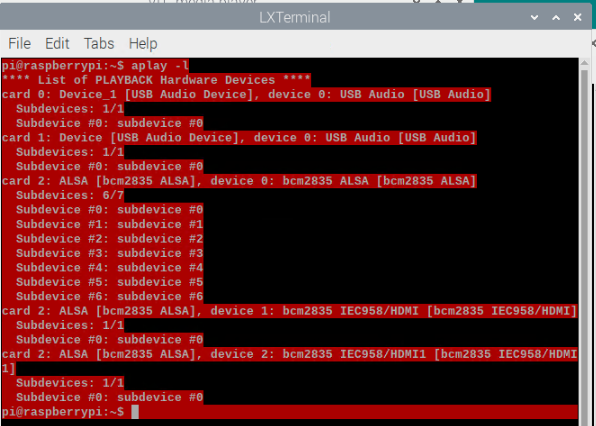

How to set up VLC to play media content / stream to a different output other than the default?

===

First, get the hardware ID of the audio output available.
>     aplay -l

Results:

Then we pick the card and device ID for the output we want to use.
For Raspberry Pi 4, the integrated audio output in this example is the card 2, device 0 (the non-HDMI output from the bcm2835 chip).

In that case we can use the `cvlc` (console vlc) command to redirect the sound:

>     cvlc http://mysource.com/radio.mp3 --aout=alsa --alsa-audio-device="hw:2,0"
     
### Automated way

To pick the bcm2835 card dynamically:

>     CARD="$(aplay -l | grep "0: bcm2835" | awk -F":" '{print $1}' | awk -F" " '{print $2}')"
>     cvlc http://mysuperaudio.com/station.mp3 --aout=alsa --alsa-audio-device="hw:$CARD,0"
