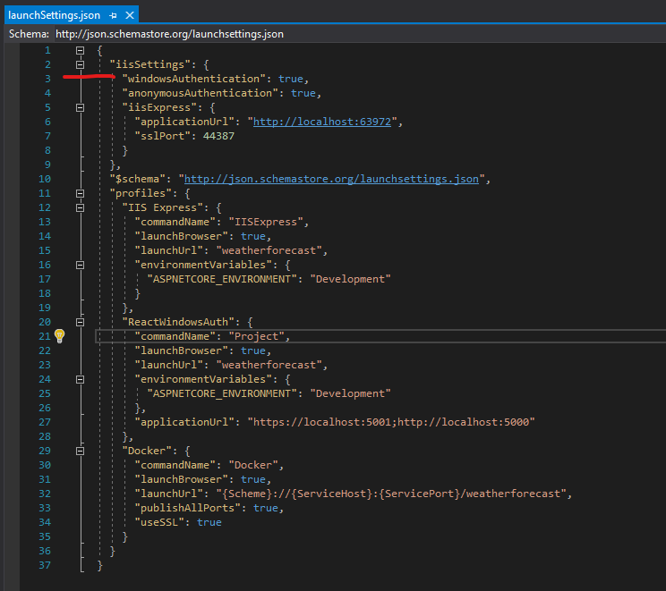

There are a lot of options out in the wild to add authentication to your application. While OAuth is among the most common, it isn’t your only option. Today I’ll show you how to accomplish Windows Authentication with React and .NET Core in a bare bones fashion.

===

All code for today’s post is found on [GitHub](https://github.com/fooberichu150/react-windows-auth). Pertinent examples are screenshots or code-snippets inline with the text.

### Exploring our Options

Let’s briefly discuss a few other options available to us before we dig into the bare bones edition. Knowing your options allows you to make the best (and educated) decision for your circumstance. This is by no means an exhaustive discussion of alternatives but just a couple of the more popular ones out there.

[Okta](https://www.okta.com/) is an identity and access management company that provides cloud based solutions. They have a [plugin/provider for Active Directory](https://www.okta.com/active-directory/). Their site contains a tutorial how to [get started adding authentication](https://developer.okta.com/code/react/) to your React application. In terms of commercial solutions, this one is frequently brought up as a go-to solution.

[Auth0](https://auth0.com/) is another commercial solution with a good following. They have a tutorial specifically about using [Active Directory / LDAP with React](https://auth0.com/authenticate/react/active-directory/).

[IdentityServer](https://identityserver.io/) is an open source alternative. Just like the others, they provide [instructions how to implement Windows Authentication](https://docs.identityserver.io/en/latest/topics/windows.html). They have a sample on [how to implement a javascript client](http://docs.identityserver.io/en/release/quickstarts/7_javascript_client.html) (such as React). Here is a post about Using [SPA (React/Angular) UI with Identity Server 4](https://medium.com/@piotrkarpaa/using-spa-react-angular-ui-with-identity-server-4-dc1f57e90b2c).

And of course, the option that we’re here to discuss today is rolling your own solution.

### Why might I not choose a turn-key solution?
While your reasons may vary, here are some I came up with.

* Insufficient infrastructure/resources to set up the service (applicable to Identity Server 4).

* Insufficient funds/budget to pay for a SAAS provider.

* You are behind a firewall, both React and .NET applications on the same network.

* You like a challenge and/or love to reinvent the wheel (ha!)

Ok maybe that last one was a bit facetious. Generally speaking using a turn-key solution is the best option but it may not be your option. It wasn’t for me in this particular use-case I ran into. Yet.

### Getting Started

In order to frame this application we need two things:

* .NET Core API project – this project will be handling the authentication, authorization, and of course API calls

* React application – this project is our GUI

The things I learned and applied for this project were a combination of Google-fu mastery and trial-and-error coding. Hopefully aggregating my experiences will make it easier for you, my reader, than it was for me.

I got started by creating a folder to contain my API and React projects, then running `dotnet new api -o ReactWindowsAuth` to scaffold a new API project. (that’s actually a lie, I used VS to create the app but let’s just pretend I used the CLI). From there, I ran `npm create-react-app test-app` to generate a basic React application named `test-app`. Personally, I like Visual Studio for my .NET code and VSCode for pretty much everything else, so I opened my new API project in VS and generated a solution file.

From here, we can now start implementing Windows Authentication with React and .NET Core!

### Framing the .NET Core API

The very first thing we need to do is make sure our application runs with Windows Authentication. Since I generated my project using VS and included Docker support I had to do a couple things that you might not have to.

### Enabling Windows Authentication

First thing I had to do was switch the debug launcher from Docker to IIS Express.

Next, I needed to open up my `launchSettings.json` and set `"windowsAuthentication": true` under the `iisSettings` key.

Ok, let’s back up just a second. In order for Windows Authentication to work you will need to host in IIS or IIS Express. You can also do it with [Kestrel](https://docs.microsoft.com/en-us/aspnet/core/security/authentication/windowsauth?view=aspnetcore-3.1&tabs=visual-studio#kestrel) and [HTTP.sys](https://docs.microsoft.com/en-us/aspnet/core/security/authentication/windowsauth?view=aspnetcore-3.1&tabs=visual-studio#httpsys) hosting but for sake of this post, let’s focus on IIS Express. If you wanted to get this working on Docker and/or Linux, you will want to use Kestrel.

Our application is now ready to work with Windows Authentication but if we launched it right now, it still wouldn’t use it. We still have some work to do.

### Configuring Windows Authentication
Now that we have our API set up to use Windows Authentication via IIS, we need to make the API itself aware of it. To do that, we need to make a couple adjustments to `Startup.cs`. [MSDN](https://docs.microsoft.com/en-us/aspnet/core/security/authentication/windowsauth?view=aspnetcore-3.1&tabs=visual-studio#iisiis-express) has documentation on it but let’s just go over it here as well.

The first thing you need to do is add `services.AddAuthentication(IISDefaults.AuthenticationScheme);` anywhere in your `ConfigureServices` method. This makes use of the `Microsoft.AspNetCore.Server.IISIntegration` namespace.

Next, you’ll need to configure which controllers or actions need to be protected by the Windows Authentication. This, by the way, is why we left `"anonymousAuthentication": true` alone in `launchSettings.json`. One use-case here is if you are using Swagger and want the documentation to be anonymously accessible and only protect the API itself.

In my use-case, I’m pretending that I want all API controllers to require authentication. Given that, I created a `WebControllerBase.cs` and decorated it with the [Authorize] attribute. Please note that you could go and mark every controller with [Authorize] instead. That said, there is actually rhyme to my reason and in a future part 2 for this post I’ll expand on the idea. For now, just roll with it.

WebControllerBase basic implementation with [Authorize] attribute
WebControllerBase, mark [Authorize] to require authentication
Next, just make our existing and new controllers inherit from `WebControllerBase` instead of `ControllerBase`.

In other examples on the web you might see people say you need to add `app.UseAuthentication()` in the `Configure(IApplicationBuilder app, IWebHostEnvironment env)` method. You don’t if you’re only targeting IIS/IIS Express. That said, it won’t hurt you to add it. I won’t judge you if you do. My source-code has it.

### Test it out!
At this point we can now test it. Slap a breakpoint at the top of `WeatherForecastController:Get` and run the web app in debug mode. When you hit your breakpoint, add a watch for `HttpContext.User` and drill down to `.Identity.Name`. Optionally, just add this line at the top of the method: `var user = HttpContext.User?.Identity?.Name ?? "N/A"`; and see what the result is. Your application is now reporting your current Windows username, right?

### Whoa, wait, you’re not done yet!
We’re close but if we want this to work in React we still have a little more work to do. [CORS.](https://developer.mozilla.org/en-US/docs/Web/HTTP/CORS) Say no more. What is CORS? CORS is cross-origin resource sharing and it’s a really fancy way of saying that you want to allow [this] to access [that]. In the real world browsers are configured by default to disallow HTTP requests initiated via scripts unless the receiving end explicitly allows it.

So… let’s make it so this API can accept CORS requests from our React application, shall we? We’re not going to get terribly fancy here. For this act to work, we need to add some settings in `appsettings.json` then set up a couple more things in `Startup.cs`.

### appsettings.json
First off, let’s go to `appsettings.json` and add the following: `"CorsOrigins": [ "http://localhost:3000" ]`,. Yes, it’s an array type. Why? Primarily because it gives you options. Let’s say that in development I opened a tunnel to my machine so somebody (or even me) could access the application from another device. Obviously they aren’t going to be connecting on `localhost` but by my hostname or IP address. All of those are options that I might want to set up.

### Startup.cs
Next we need to add CORS to both our Services and Middleware. In `ConfigureServices`, please add the following code:

>     // add this class somewhere outside of the Startup class
>     public class Constants
>     {
>     	public const string CORS_ORIGINS = "CorsOrigins";
>     }
>     
>     services.AddCors(opt =>
>     {
>     	opt.AddPolicy("CorsPolicy", builder => builder
>     		.AllowAnyHeader()
>     		.AllowAnyMethod()
>     		.WithOrigins(Configuration.GetSection(Constants.CORS_ORIGINS).Get<string[]>())
>     		.AllowCredentials());
>     });

Brief explanation of this code. It allows any header to be passed, any http method to be used (GET, POST, PUT, DELETE, etc), has to be from one of the origins specific from our config, and allow credentials to be passed in the header. In your own application you may change many of these settings. You might not change any of them. At least you’re now aware of them.

Next we need to add `app.UseCors("CorsPolicy")` into our `Configure(app, env)` method. Please note that this is middleware and order matters. In this case, it needs to come after `app.UseRouting()` but before `app.UseAuthentication()` and `app.UseAuthorization()`. As an aside, if you ever add middleware and it isn’t working correctly you should check the order it is registered.

Now we’re ready to get our React application hooked up with Windows Authentication, woot!

### Windows Authentication with React – Hook it Up!
Excited for this? I know I am. This is way easier than you think. Ready for it? All you need to do is add two properties to your `fetch` request: `credentials: "include"` and `mode: 'cors'`. Boom. What will happen is that if you are accessing a site not already on the same domain (or computer) as you, the browser will prompt you for credentials to that Active Directory, LDAP, or Machine instance. After you successfully authenticate, the browser stores it for future requests. If you are on the exact same machine or domain then it will not prompt the credentials.

Now that said, there are ways you can (and probably should) set up your service calls so you don’t have to keep typing that same garbage in all over the place. When I first started working with React I quickly realized that it was easier to set up some fetch helpers to start. The next thing I realized was that it was easier to match all my .NET API Controllers with “services” in my React code.

With that in mind, let’s look at my fetch-helpers and an example service.

### fetch-helpers.js

Here are some ultra-basic helpers I have in this test-app:

>     export const handleResponse = (response) => {
>       return response.text().then((text) => {
>         const data = text && JSON.parse(text);
>         if (!response.ok) {
>           const error = (data && data) || response.statusText;
>           return Promise.reject(error);
>         }
>     
>         return data;
>       });
>     };
>     
>     export const requestBase = (() => {
>       if (typeof window !== "undefined") {
>         return {
>           method: "POST",
>           credentials: "include",
>           mode: 'cors',
>           headers: new Headers({
>             Accept: "application/json",
>             "Content-Type": "application/json",
>           }),
>         };
>       } else
>         return {
>           method: "POST",
>           credentials: "include",
>           // mode: 'cors',
>           headers: {
>             Accept: "application/json",
>             "Content-Type": "application/json",
>           },
>         };
>     })();

Of note is that the `requestBase` can have a different return object if it is NodeJS (prerendered React) or not. It is very hard to spot the differences but the browserless version sets headers as an instance of an Headers object whereas browser version simply sets a JSON object.

### weather-api.js
Next, let’s look at how our service consumes the `fetch-helpers`. First off the `apiBase` below is the full url. Clearly you wouldn’t do that but would actually set the baseUrl for React at a higher level (generally at the HTML level). This is sample code, take it with a grain of salt.

>     import { handleResponse, requestBase } from "../_helpers";
>     
>     const apiBase = "https://localhost:44387/weatherforecast";
>     
>     class WeatherForecastService {
>       getForecasts() {
>         let request = Object.assign({}, requestBase, { method: "GET" });
>         let url = `${apiBase}`;
>     
>         return fetch(url, request).then(handleResponse);
>       }
>     
>       getProtectedForecast() {
>         let request = Object.assign({}, requestBase, { method: "GET" });
>         let url = `${apiBase}/5`;
>     
>         return fetch(url, request).then(handleResponse);
>       }
>     }
>     
>     const instance = Object.freeze(new WeatherForecastService());
>     export { instance as WeatherForecastService };

All I’m doing here is exposing the methods I want React to have access to, wrapping them around my `baseRequest` from fetch-helpers, handling the response using my `handleResponse` also from fetch-helpers, and then passing back to the caller.

### Last but certainly not least, hook it up!

Now that we’ve laid all the pipe-work it’s time to connect everything. I’m just editing `App.js` directly. Sue me. For the example I’m importing all three API service files and then setting up some const functions for each button click I wanted to handle. Every one of those just logs out to the console rather than munging with the components. Lastly, of course, are the buttons themselves. Since this file is pretty huge with the modifications I’m only going to snippet out one of the button events and the React button component itself that calls it.

>     const getProtectedForecast = () => {
>     console.log("attempting...");
>     
>     WeatherForecastService.getProtectedForecast()
>       .then((response) => {
>     	console.log("response: ", JSON.stringify(response));
>     	console.log("oh boy!");
>       })
>       .catch((err) => {
>     	console.error(err);
>       });
>     };
>     
>     <button type="button" onClick={getProtectedForecast}>
>     Get protected forecast
>     </button>

### Bonus Round – Windows Authentication Role-based Security
While the above setup was really basic it is missing one really important piece, isn’t it? Role-based security. Consider this right here a very brief introduction to part 2 while I’ll write sometime in the not-so-distant future. If you’ve been clicking around the code while reading this post you might have noticed the following line in `Startup.cs:ConfigureServices`: 

>     services.AddTransient<Microsoft.AspNetCore.Authentication.IClaimsTransformer, ClaimsTransformer>();.

If you didn’t notice it, that’s ok because I’ll talk about it now.

After a user is authenticated but before they are authorized, the authorization provider will call your custom `IClaimsTransformation` implementation if provided. [See MSDN](https://docs.microsoft.com/en-us/dotnet/api/microsoft.aspnetcore.authentication.iclaimstransformation?view=aspnetcore-3.1). In my implementation (located in `ClaimsTransformer`) you’ll see that I’m just arbitrarily adding the role “Super-awesome” as the same claim type our `WindowsIdentity` uses for it’s claim type.

Next, you may have noticed in the `WeatherForecastController` I added a `GetAnother` method call which requires the “Super-awesome” role. Under that one, I also added a `GetFail` method which will always fail since the user isn’t in the “Admin” role. Neither of those methods are hooked up in the React application and require you to hit them directly in the browser to see them work (or not work, as it may be).

### Conclusion

Hooking up Windows Authentication to your React apps is not terribly difficult. It is also pretty basic. Turn-key solutions will get you a lot farther a lot quicker but if you don’t have the infrastructure or the coin, you can still roll your own. As usual, code from my blog posts can be found on GitHub.

### Additional Reading
[Authorization on MSDN](https://docs.microsoft.com/en-us/aspnet/core/security/authorization/roles?view=aspnetcore-3.1)

[Custom Authorization Attributes (alternative to roles)](https://docs.microsoft.com/en-us/aspnet/core/security/authorization/iauthorizationpolicyprovider?view=aspnetcore-3.1#custom-authorization-attributes)

Luke Linder on [Windows Authentication with .NET Core and Angular](https://medium.com/@lukelindner/windows-authentication-with-net-core-api-and-angular-project-on-iis-ae16a573902e)

### Source
[Seeleycoder - WINDOWS AUTHENTICATION WITH REACT AND .NET CORE: BARE BONES](https://www.seeleycoder.com/blog/windows-authentication-with-react/)

[Archive - https://archive.ph/KHVaA](https://archive.ph/KHVaA)
